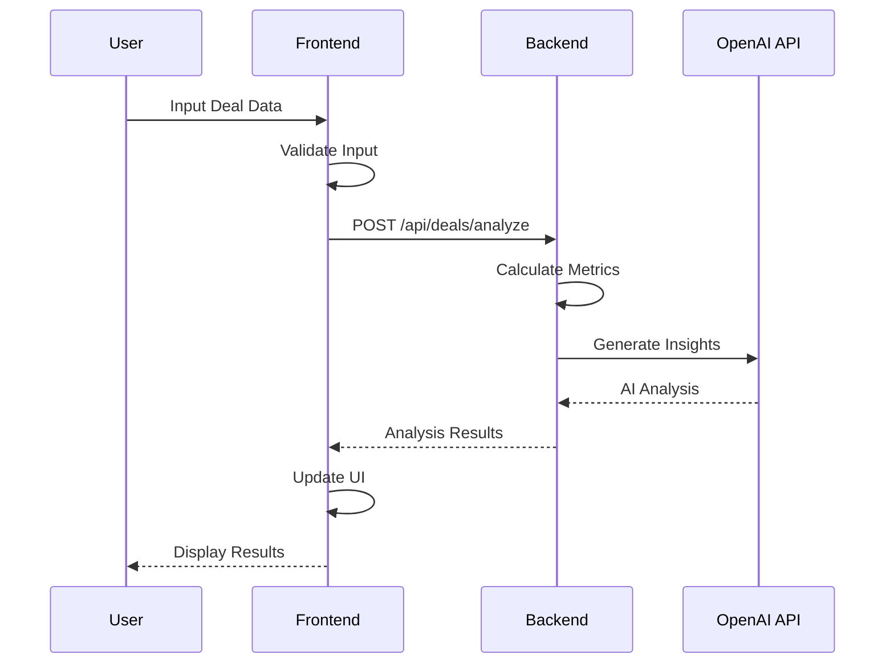
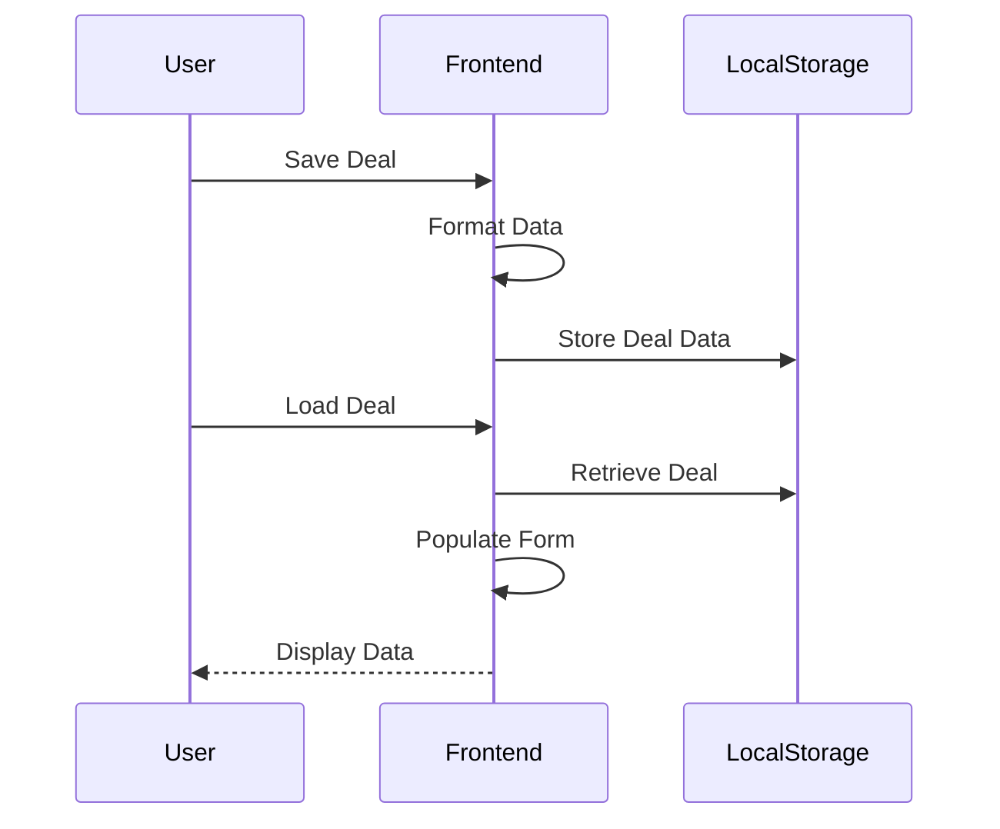

# Real Estate Deal Analyzer - Architecture Documentation

## System Overview
The Real Estate Deal Analyzer is a full-stack web application built using React (frontend) and Node.js/Express (backend). The application helps users analyze real estate investment opportunities by calculating key metrics and providing detailed financial projections for both Single Family (SFR) and Multi-Family (MF) properties.

## Technical Stack

### Frontend
- **Framework:** React with TypeScript
- **UI Library:** Material-UI (MUI) v7
- **Data Visualization:** Recharts
- **State Management:** React Hooks
- **Type Checking:** TypeScript
- **Data Persistence:** LocalStorage
- **Build Tool:** Vite

### Backend
- **Runtime:** Node.js
- **Framework:** Express.js
- **Type Safety:** TypeScript
- **API Documentation:** OpenAPI/Swagger
- **Logging:** Winston
- **Error Handling:** Custom middleware

## Technical Decisions

### 1. Data Storage Strategy
**Current Implementation:** Browser LocalStorage
- Deals and analysis data stored in browser's localStorage
- Structured data format for both SFR and MF properties
- Unique ID generation for each deal
- Data model:
  ```typescript
  interface Deal {
    id: string;
    name: string;
    type: 'SFR' | 'MF';
    propertyAddress: {
      street: string;
      city: string;
      state: string;
      zip: string;
    };
    data: {
      // Property details
      purchasePrice: number;
      propertyType: string;
      yearBuilt: number;
      squareFootage: number;
      
      // Financial details
      downPayment: number;
      interestRate: number;
      loanTerm: number;
      closingCosts: number;
      repairCosts: number;
      
      // For MF properties
      unitTypes?: Array<{
        type: string;
        count: number;
        sqft: number;
        monthlyRent: number;
      }>;
      
      // Analysis results
      monthlyAnalysis: MonthlyAnalysis;
      annualAnalysis: AnnualAnalysis;
      longTermAnalysis: LongTermAnalysis;
    };
    savedAt: string;
    lastModified: string;
  }
  ```

**Future Implementation:** MongoDB
- Plan to migrate to MongoDB for scalable, document-based storage
- Rationale for MongoDB:
  ```javascript
  // Example future data model
  const dealSchema = {
    _id: ObjectId,
    propertyDetails: {
      address: String,
      characteristics: Object,
      financials: Object
    },
    analysis: {
      monthly: Object,
      annual: Object,
      longTerm: Object
    },
    metadata: {
      createdAt: Date,
      updatedAt: Date,
      userId: ObjectId
    }
  }
  ```
- Benefits of planned migration:
  - Better query performance
  - Schema flexibility
  - Horizontal scaling
  - Built-in replication
  - Rich querying capabilities

### 2. Analysis Engine
**Current Implementation:**
- Comprehensive financial calculations:
  ```typescript
  interface MonthlyAnalysis {
    expenses: {
      rent?: number;
      propertyTax?: number;
      insurance?: number;
      maintenance?: number;
      propertyManagement?: number;
      vacancy?: number;
      mortgage?: {
        total: number;
        downPayment?: number;
      };
      closingCosts?: number;
      repairCosts?: number;
      total?: number;
    };
    cashFlow?: number;
    cashFlowAfterTax?: number;
  }

  interface AnnualAnalysis {
    dscr: number;
    cashOnCashReturn: number;
    capRate: number;
    totalInvestment: number;
    annualNOI: number;
    annualDebtService: number;
    effectiveGrossIncome: number;
  }

  interface LongTermAnalysis {
    yearlyProjections: Array<{
      year: number;
      cashFlow: number;
      propertyValue: number;
      equity: number;
      propertyTax: number;
      insurance: number;
      maintenance: number;
      propertyManagement: number;
      vacancy: number;
      operatingExpenses: number;
      noi: number;
      debtService: number;
      grossRent: number;
      mortgageBalance: number;
      appreciation: number;
      totalReturn: number;
    }>;
    projectionYears: number;
    returns: {
      irr: number;
      totalCashFlow: number;
      totalAppreciation: number;
      totalReturn: number;
    };
    exitAnalysis: {
      projectedSalePrice: number;
      sellingCosts: number;
      mortgagePayoff: number;
      netProceedsFromSale: number;
    };
  }
  ```

### 3. UI Components
**Key Components:**
1. **DealForm/MultiFamilyForm**
   - Property details input
   - Financial assumptions
   - Unit mix builder (MF)
   - Form validation
   - Deal saving/loading

2. **AnalysisResults**
   - Key metrics display with tooltips
   - Monthly analysis table
   - Annual projections table
   - Exit analysis
   - Interactive charts:
     - Cash flow trends
     - Expense breakdown
     - Equity growth
     - Return components

3. **SavedDeals**
   - Deal list management
   - Deal editing
   - Deal comparison
   - Timestamp tracking

### 4. AI Integration Strategy
**Current Implementation:** OpenAI API Placeholder
- Basic integration structure is in place
- Using placeholder API responses
- Error handling for missing API keys
```javascript
// Current placeholder implementation
const getAIInsights = async (analysis) => {
  try {
    // Placeholder response until OpenAI integration is complete
    return {
      insights: "AI insights will be available in future updates.",
      recommendations: [],
      riskAnalysis: "Pending AI integration"
    };
  } catch (error) {
    logger.error('Error getting AI insights:', error);
    return null;
  }
};
```

**Future Implementation:** Full OpenAI Integration
- Planned features:
  - Market analysis
  - Investment recommendations
  - Risk assessment
  - Comparative market analysis
- Implementation roadmap:
  ```javascript
  // Future implementation structure
  const getAIInsights = async (analysis) => {
    const openai = new OpenAI({
      apiKey: process.env.OPENAI_API_KEY
    });
    
    const response = await openai.chat.completions.create({
      model: "gpt-4",
      messages: [
        {
          role: "system",
          content: generateAnalysisPrompt(analysis)
        },
        {
          role: "user",
          content: generateAnalysisPrompt(analysis)
        }
      ],
      temperature: 0.7,
      max_tokens: 1500
    });

    return processAIResponse(response);
  };
  ```

## Architecture Diagram
```
┌─────────────────┐         ┌──────────────────┐         ┌─────────────────┐
│    Frontend     │         │     Backend      │         │    Database     │
│    (React)     │ ───────>│  (Node/Express)  │ ───────>│   (Optional)    │
└─────────────────┘         └──────────────────┘         └─────────────────┘
       │                           │
       │                           │
       ▼                           ▼
┌─────────────────┐         ┌──────────────────┐
│  Material UI    │         │  OpenAI API      │
│  Components     │         │  (AI Insights)   │
└─────────────────┘         └──────────────────┘
```

## Sequence Diagrams

### Deal Analysis Flow


### Data Persistence Flow


## Frontend Architecture

### Core Components

1. **DealAnalysis** (`/frontend/src/pages/DealAnalysis.tsx`)
   ```typescript
   interface AnalysisResult {
     monthlyAnalysis: MonthlyAnalysis;
     annualAnalysis: AnnualAnalysis;
     longTermAnalysis: LongTermAnalysis;
   }
   ```
   - State Management:
     - `analysisResult`: Stores analysis data
     - `error`: Handles error states
   - Key Methods:
     - `handleAnalyze`: Processes form submission
     - `handleError`: Error handling logic

2. **DealForm** (`/frontend/src/components/DealAnalysis/DealForm.jsx`)
   - Form Sections:
     - Property Information
     - Financial Details
     - Assumptions
   - Validation Rules:
     ```javascript
     const validateForm = () => {
       // Required fields
       // Numeric validation
       // Range checks
     };
     ```
   - Local Storage Integration:
     ```javascript
     const handleSave = () => {
       localStorage.setItem('savedDeals', JSON.stringify(deals));
     };
     ```

3. **AnalysisResults** (`/frontend/src/components/DealAnalysis/AnalysisResults.jsx`)
   - Display Components:
     - MetricCards: Key financial indicators
     - Charts: Data visualization
     - Tables: Detailed projections
   - Chart Types:
     - Line: Cash flow trends
     - Pie: Expense breakdown
     - Bar: Return components
     - Area: Equity growth

### UI Framework Details
- Material-UI (MUI) v7
  - Custom Theme:
    ```javascript
    const theme = {
      palette: {
        primary: { main: '#2563eb' },
        secondary: { main: '#4f46e5' }
      },
      typography: {
        fontFamily: 'Inter, Roboto, sans-serif'
      }
    }
    ```
  - Responsive Breakpoints:
    - xs: 0px
    - sm: 600px
    - md: 960px
    - lg: 1280px
    - xl: 1920px

## Backend Architecture

### API Layer
- Express.js Configuration:
  ```javascript
  app.use(cors());
  app.use(express.json());
  app.use(morgan('combined'));
  app.use('/api/deals', dealRoutes);
  ```

### Core Modules

1. **Analysis Engine** (`/backend/src/utils/analysis.js`)
   - Financial Calculations:
     ```javascript
     // Monthly Cash Flow
     const calculateMonthlyCashFlow = (income, expenses) => {
       return income - expenses - mortgagePayment;
     };

     // Cap Rate
     const calculateCapRate = (noi, purchasePrice) => {
       return (noi * 12 / purchasePrice) * 100;
     };

     // Cash on Cash Return
     const calculateCashOnCash = (annualCashFlow, totalInvestment) => {
       return (annualCashFlow / totalInvestment) * 100;
     };

     // Internal Rate of Return (IRR)
     const calculateIRR = (cashFlows) => {
       // Newton-Raphson method implementation
     };
     ```

2. **Deal Controller** (`/backend/src/controllers/deals.js`)
   - Request Processing:
     ```javascript
     exports.analyzeDeal = async (req, res) => {
       try {
         const analysis = await performAnalysis(req.body);
         const aiInsights = await getAIInsights(analysis);
         res.json({ ...analysis, aiInsights });
       } catch (error) {
         handleError(error, res);
       }
     };
     ```

3. **AI Integration** (`/backend/src/controllers/deals.js`)
   - OpenAI Configuration:
     ```javascript
     const openai = new OpenAI({
       apiKey: process.env.OPENAI_API_KEY
     });
     ```
   - Prompt Engineering:
     ```javascript
     const generatePrompt = (analysis) => {
       return `Analyze this real estate investment:
         Property Value: ${analysis.propertyValue}
         Cash Flow: ${analysis.cashFlow}
         ...`;
     };
     ```

### Middleware Configuration
```javascript
// CORS
const corsOptions = {
  origin: process.env.FRONTEND_URL,
  methods: ['GET', 'POST', 'PUT', 'DELETE'],
  allowedHeaders: ['Content-Type', 'Authorization']
};

// Error Handling
const errorHandler = (err, req, res, next) => {
  logger.error(err.stack);
  res.status(500).json({ error: err.message });
};
```

### Logging Configuration
```javascript
const winston = require('winston');

const logger = winston.createLogger({
  level: 'info',
  format: winston.format.combine(
    winston.format.timestamp(),
    winston.format.json()
  ),
  transports: [
    new winston.transports.File({ filename: 'logs/error.log', level: 'error' }),
    new winston.transports.File({ filename: 'logs/all.log' })
  ]
});
```

## Data Adapter Architecture

### Storage vs. Calculation Rules

The application uses a clear set of rules to determine what data is stored in the database versus what is calculated on-demand. These rules are implemented in the `analysisAdapter.ts` module that handles data normalization between the backend and frontend.

#### Stored Data (Database)
The following data is preserved from the database:
1. **Core Property Data**:
   - Purchase price, rent, loan details, tax rates, etc.
   - Property characteristics (bedrooms, square footage, etc.)
   - Address and metadata

2. **Monthly Analysis Base Values**:
   - Monthly income/rent
   - Monthly expense breakdown (mortgage, tax, insurance, etc.)
   - Monthly cash flow

3. **AI Insights**:
   - Stored as-is when generated
   - Not recalculated unless explicitly requested

#### Calculated Data (On-Demand)
The following data is always recalculated when a deal is loaded:
1. **Year-by-Year Projections**:
   - Future property values with appreciation
   - Future rental income with growth
   - Future expenses with inflation
   - Mortgage balance and equity over time
   - Cash flow for each year

2. **Exit Analysis**:
   - Projected sale price
   - Selling costs
   - Mortgage payoff
   - Net proceeds from sale
   - Total return on investment

3. **Annual Totals** (if missing):
   - Annual income (derived from monthly × 12)
   - Annual expenses (derived from monthly × 12)
   - Annual cash flow

#### Adapter Rules Implementation
```typescript
/**
 * Adapter Rules:
 * 1. Core property data is preserved from the stored deal
 * 2. Monthly analysis is preserved with normalization to ensure consistent structure
 * 3. All projections are ALWAYS recalculated to ensure consistency
 * 4. Exit analysis is always recalculated based on the projections
 * 5. Annual analysis is derived from monthly values if missing
 * 6. AI Insights are preserved as-is from the stored deal
 */
export function adaptAnalysisForFrontend(analysis: any): any {
  // Implementation follows these rules
}
```

### Benefits of this Approach
1. **Consistency**: All derived values use the same calculation logic, regardless of when they were created
2. **Storage Efficiency**: Only core data is stored, reducing database size
3. **Flexibility**: Calculation logic can be updated without migrating existing data
4. **Resilience**: Missing or incomplete data is handled gracefully with recalculation

### AI Analysis Handling
Unlike numerical projections, AI analysis:
1. Is preserved as-is when loaded from the database
2. Is expensive to regenerate (requires API calls)
3. Represents a point-in-time assessment that doesn't need automatic recalculation

## Calculation Algorithms

### Financial Metrics

1. **Debt Service Coverage Ratio (DSCR)**
   ```javascript
   const calculateDSCR = (noi, debtService) => {
     return noi / debtService;
   };
   ```

2. **Net Operating Income (NOI)**
   ```javascript
   const calculateNOI = (
     grossRent,
     vacancy,
     operatingExpenses
   ) => {
     const effectiveGrossIncome = grossRent * (1 - vacancy);
     return effectiveGrossIncome - operatingExpenses;
   };
   ```

3. **Internal Rate of Return (IRR)**
   ```javascript
   const calculateIRR = (cashFlows, guess = 0.1) => {
     const maxIterations = 1000;
     const tolerance = 0.000001;
     
     for (let i = 0; i < maxIterations; i++) {
       const npv = cashFlows.reduce((sum, cf, t) => 
         sum + cf / Math.pow(1 + guess, t), 0
       );
       
       if (Math.abs(npv) < tolerance) return guess;
       
       const derivativeNPV = cashFlows.reduce((sum, cf, t) =>
         sum - t * cf / Math.pow(1 + guess, t + 1), 0
       );
       
       guess = guess - npv / derivativeNPV;
     }
     
     return null; // No solution found
   };
   ```

## Development Environment

### Frontend Setup
```bash
cd frontend
npm install
npm start  # Runs on port 3000
```

### Backend Setup
```bash
cd backend
npm install
npm run dev  # Runs on port 3001
```

### Environment Variables
```env
# Backend (.env)
PORT=3001
NODE_ENV=development
OPENAI_API_KEY=your_openai_api_key
CORS_ORIGIN=http://localhost:3000

# Frontend (.env)
REACT_APP_API_URL=http://localhost:3001
```

## Testing Strategy

### Frontend Tests
- Unit Tests: Jest + React Testing Library
- Component Tests: Storybook
- E2E Tests: Cypress

### Backend Tests
- Unit Tests: Jest
- Integration Tests: Supertest
- API Tests: Postman Collections

## Performance Optimization

### Frontend
1. Code Splitting
2. Lazy Loading
3. Memoization
4. Virtual Scrolling for Large Tables

### Backend
1. Response Caching
2. Query Optimization
3. Rate Limiting
4. Compression

## Error Handling

### Frontend
```javascript
class ErrorBoundary extends React.Component {
  state = { hasError: false, error: null };
  
  static getDerivedStateFromError(error) {
    return { hasError: true, error };
  }
  
  render() {
    if (this.state.hasError) {
      return <ErrorDisplay error={this.state.error} />;
    }
    return this.props.children;
  }
}
```

### Backend
```javascript
const handleError = (error, res) => {
  logger.error(error.stack);
  
  if (error instanceof ValidationError) {
    return res.status(400).json({
      error: 'Validation Error',
      details: error.details
    });
  }
  
  res.status(500).json({
    error: 'Internal Server Error',
    message: error.message
  });
};
```

## Monitoring and Logging

### Frontend
- Error Tracking: Sentry
- Performance Monitoring: Google Analytics
- Console Logging: Custom Logger

### Backend
- Application Logs: Winston
- Request Logging: Morgan
- Performance Metrics: Express Status Monitor

## Security Measures

1. Input Validation
2. XSS Protection
3. CSRF Protection
4. Rate Limiting
5. Secure Headers
6. API Key Protection
7. Error Sanitization

## Deployment

### Frontend (Netlify/Vercel)
```toml
[build]
  command = "npm run build"
  publish = "build"

[[redirects]]
  from = "/*"
  to = "/index.html"
  status = 200
```

### Backend (Node.js/PM2)
```javascript
// ecosystem.config.js
module.exports = {
  apps: [{
    name: "real-estate-analyzer",
    script: "src/index.js",
    instances: "max",
    exec_mode: "cluster",
    env: {
      NODE_ENV: "production",
      PORT: 3001
    }
  }]
};
```

## Future Enhancements

1. User Authentication
   - JWT Implementation
   - Role-based Access Control

2. Deal Comparison
   - Side-by-side Analysis
   - Metric Comparison Charts

3. PDF Reports
   - Custom Templates
   - Dynamic Generation

4. Mobile Application
   - React Native
   - Offline Support

5. Market Data Integration
   - Real Estate APIs
   - Market Trends

6. Data Persistence
   - MongoDB Integration
   - Data Migration

7. Enhanced AI Features
   - Market Analysis
   - Investment Recommendations

## 2025-06-03 Backend Update

### TypeScript-First Workflow
- The backend now runs directly from TypeScript source using `ts-node` and `nodemon`.
- `.env` is loaded at the very top of `src/index.ts` to ensure all environment variables are available.
- All old JS files in `src/` have been removed to prevent stale code from being loaded.

### Unified Analysis Engine
- The `/api/deals/analyze` endpoint now handles both SFR and MF analysis.
- The backend branches on `propertyType` and uses the appropriate analyzer.
- The response always includes: `monthlyAnalysis`, `annualAnalysis`, `longTermAnalysis`, `keyMetrics`, and `aiInsights`.

### Sample Endpoints for Testing
- `/api/deals/sample-sfr` and `/api/deals/sample-mf` return valid sample payloads for SFR and MF, respectively.

### Automated Smoke Testing
- On server startup, a script (`testApiOnStartup.ts`) runs and verifies:
  - Sample endpoints return valid data.
  - Analysis endpoint returns all required fields.
- Logs `[PASS]` or `[FAIL]` for each check.

### OpenAI Integration
- Updated to use OpenAI v4+ SDK (`openai.completions.create`).
- All property access is now safe to prevent runtime errors if analysis structure is missing fields.

### Router and Controller Hygiene
- Sample endpoints are registered before parameterized routes to avoid route shadowing.
- Debug logs were used to confirm correct file loading and endpoint execution.

### API Contract
- All analysis responses include the required fields for both SFR and MF.
- See `API.md` for full request/response structure.

### AI Prompt Engineering (2025-06 Update)

#### Multi-Family AI Analysis Prompt (mfAnalysisPrompt)
- The `mfAnalysisPrompt` function generates a detailed prompt for OpenAI to analyze multi-family (MF) property investments.
- **Context:**
  - The prompt is constructed using metrics and data already calculated by the backend analysis engine (e.g., DSCR, Cap Rate, Cash on Cash, NOI, unit mix, price per unit, etc.).
  - No financial metrics are recalculated in the prompt function; it only formats and summarizes the results for the AI.
- **Prompt Content:**
  - Property details (address, units, square footage, year built, price per unit/sqft)
  - Unit mix breakdown
  - Financial metrics (purchase price, down payment, interest rate, loan term, mortgage, NOI, DSCR, Cap Rate, Cash on Cash)
  - Operating expenses (property management, vacancy, maintenance, utilities, common area)
  - Long-term assumptions (rent/expense growth, value appreciation, projection years, selling costs)
  - Requests a structured JSON response from the AI, including summary, strengths, weaknesses, recommendations, unit mix analysis, market position, value-add opportunities, investment score, and hold period.
- **Best Practice:**
  - All numbers and metrics in the prompt are sourced from the backend's analysis output, ensuring consistency and no redundant calculations.
  - The prompt function is a formatter, not a calculator. 