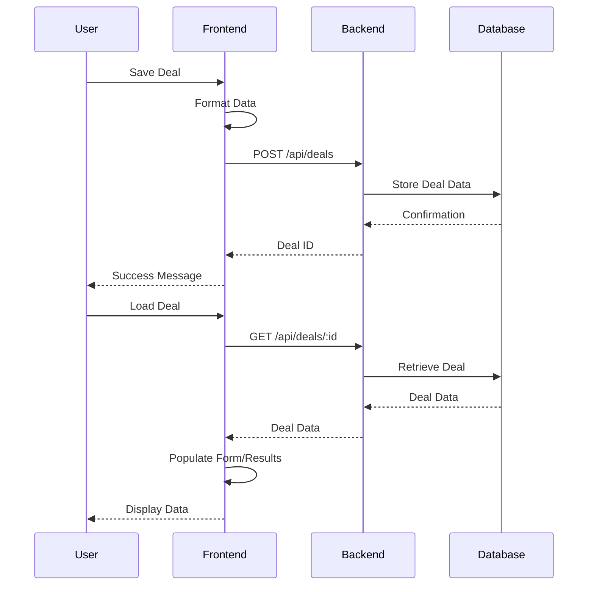

# Real Estate Deal Analyzer - Architecture Documentation

## System Overview
The Real Estate Deal Analyzer is a full-stack web application built using React (frontend) and Node.js/Express (backend). The application helps users analyze real estate investment opportunities by calculating key metrics and providing detailed financial projections for both Single Family (SFR) and Multi-Family (MF) properties.

## Technical Stack

### Frontend
- **Framework:** React with TypeScript
- **UI Library:** Material-UI (MUI) v7
- **Data Visualization:** Recharts
- **State Management:** React Hooks
- **Type Checking:** TypeScript
- **Data Persistence:** LocalStorage & Backend API
- **Build Tool:** Vite

### Backend
- **Runtime:** Node.js
- **Framework:** Express.js
- **Type Safety:** TypeScript
- **API Documentation:** OpenAPI/Swagger
- **Logging:** Winston
- **Error Handling:** Custom middleware

## Single-Family Rental (SFR) Analysis Implementation

### Core Components

1. **SFRPropertyForm** (`/frontend/src/components/SFRAnalysis/SFRPropertyForm.tsx`)
   - Collects all property data inputs including:
     - Property details (price, address, bedrooms, etc.)
     - Financial data (down payment, interest rate, loan term)
     - Monthly income and expenses
     - Long-term assumptions (appreciation, inflation, etc.)
   - Performs client-side validation
   - Submits data to analysis engine

2. **AnalysisResults** (`/frontend/src/components/SFRAnalysis/AnalysisResults.tsx`)
   - Tabbed interface for different analysis views:
     - Summary: Key metrics and investment indicators
     - Monthly Analysis: Detailed income and expense breakdown
     - Annual Analysis: Year 1 financial metrics
     - Long-Term Analysis: 10-year projections with charts
   - Visualization components:
     - Cash flow trend line chart
     - Expense breakdown pie chart
     - Equity growth area chart
     - Return components bar chart
   - Interactive tables for detailed metrics

3. **SFRAnalysis Page** (`/frontend/src/pages/SFRAnalysis.tsx`)
   - Coordinates between form and results components
   - Manages API calls for property analysis
   - Handles loading, saving, and error states
   - Provides sample data loading functionality

### Key Calculations

1. **Monthly Analysis**
   - **Monthly Mortgage Payment**: 
     ```typescript
     const monthlyMortgage = (principal, rate, term) => {
       const monthlyRate = rate / 12 / 100;
       const payments = term * 12;
       return (principal * monthlyRate * Math.pow(1 + monthlyRate, payments)) / 
              (Math.pow(1 + monthlyRate, payments) - 1);
     }
     ```
   - **Operating Expenses**: Sum of property tax, insurance, maintenance, property management, vacancy
   - **Cash Flow**: Effective Gross Income - Operating Expenses - Mortgage Payment

2. **Annual Analysis**
   - **Net Operating Income (NOI)**: Annual Effective Gross Income - Annual Operating Expenses
   - **Cap Rate**: (NOI / Purchase Price) * 100
   - **Cash on Cash Return**: (Annual Cash Flow / Total Investment) * 100
   - **Debt Service Coverage Ratio (DSCR)**: NOI / Annual Debt Service

3. **Long-Term Analysis**
   - **Year-over-Year Projections**:
     - Income growth based on rent increase percentage
     - Expense inflation adjustment
     - Property value appreciation
     - Mortgage balance reduction
     - Equity accumulation
   - **Return Calculations**:
     - IRR (Internal Rate of Return)
     - ROI (Return on Investment)
     - Total appreciation
     - Total cash flow
     - Total return

### Data Flow

1. User inputs property data into SFRPropertyForm
2. Form data is validated and sent to backend via API
3. Backend calculates all metrics and projections
4. Results are returned to frontend and displayed in AnalysisResults
5. User can save the analysis to the database
6. Saved deals can be loaded and viewed from SavedProperties page

### Validation & Error Handling

- Client-side form validation ensures required fields
- Backend validation confirms data integrity
- Error boundaries catch and display rendering errors
- Network error handling with user-friendly messages
- Edge case handling for zero values and missing data

## Technical Decisions

### 1. Data Storage Strategy
**Current Implementation:** Hybrid approach
- MongoDB for persistent storage (planned)
- Browser LocalStorage for temporary data
- Structured data format for both SFR and MF properties
- Unique ID generation for each deal
- Data model:
  ```typescript
  interface Deal {
    id: string;
    name: string;
    type: 'SFR' | 'MF';
    propertyAddress: {
      street: string;
      city: string;
      state: string;
      zip: string;
    };
    data: {
      // Property details
      purchasePrice: number;
      propertyType: string;
      yearBuilt: number;
      squareFootage: number;
      
      // Financial details
      downPayment: number;
      interestRate: number;
      loanTerm: number;
      closingCosts: number;
      repairCosts: number;
      
      // For MF properties
      unitTypes?: Array<{
        type: string;
        count: number;
        sqft: number;
        monthlyRent: number;
      }>;
      
      // Analysis results
      monthlyAnalysis: MonthlyAnalysis;
      annualAnalysis: AnnualAnalysis;
      longTermAnalysis: LongTermAnalysis;
    };
    savedAt: string;
    lastModified: string;
  }
  ```

### 2. Analysis Engine
**Current Implementation:**
- Comprehensive financial calculations:
  ```typescript
  interface MonthlyAnalysis {
    expenses: {
      rent?: number;
      propertyTax?: number;
      insurance?: number;
      maintenance?: number;
      propertyManagement?: number;
      vacancy?: number;
      mortgage?: {
        total: number;
        downPayment?: number;
      };
      closingCosts?: number;
      repairCosts?: number;
      total?: number;
    };
    cashFlow?: number;
    cashFlowAfterTax?: number;
  }

  interface AnnualAnalysis {
    dscr: number;
    cashOnCashReturn: number;
    capRate: number;
    totalInvestment: number;
    annualNOI: number;
    annualDebtService: number;
    effectiveGrossIncome: number;
  }

  interface LongTermAnalysis {
    yearlyProjections: Array<{
      year: number;
      cashFlow: number;
      propertyValue: number;
      equity: number;
      propertyTax: number;
      insurance: number;
      maintenance: number;
      propertyManagement: number;
      vacancy: number;
      operatingExpenses: number;
      noi: number;
      debtService: number;
      grossRent: number;
      mortgageBalance: number;
      appreciation: number;
      totalReturn: number;
    }>;
    projectionYears: number;
    returns: {
      irr: number;
      totalCashFlow: number;
      totalAppreciation: number;
      totalReturn: number;
    };
    exitAnalysis: {
      projectedSalePrice: number;
      sellingCosts: number;
      mortgagePayoff: number;
      netProceedsFromSale: number;
    };
  }
  ```

### 3. UI Components
**Key Components:**
1. **SFRPropertyForm**
   - Property details input
   - Financial assumptions
   - Form validation
   - Deal saving/loading

2. **AnalysisResults**
   - Key metrics display with tooltips
   - Monthly analysis table
   - Annual projections table
   - Exit analysis
   - Interactive charts:
     - Cash flow trends
     - Expense breakdown
     - Equity growth
     - Return components

3. **SavedProperties**
   - Professional table view of all properties
   - Metrics comparison columns
   - Sorting and filtering options
   - Property management actions

### 4. AI Integration Strategy
**Current Implementation:** OpenAI API Placeholder
- Basic integration structure is in place
- Using placeholder API responses
- Error handling for missing API keys
```javascript
// Current placeholder implementation
const getAIInsights = async (analysis) => {
  try {
    // Placeholder response until OpenAI integration is complete
    return {
      insights: "AI insights will be available in future updates.",
      recommendations: [],
      riskAnalysis: "Pending AI integration"
    };
  } catch (error) {
    logger.error('Error getting AI insights:', error);
    return null;
  }
};
```

**Future Implementation:** Full OpenAI Integration
- Planned features:
  - Market analysis
  - Investment recommendations
  - Risk assessment
  - Comparative market analysis
- Implementation roadmap:
  ```javascript
  // Future implementation structure
  const getAIInsights = async (analysis) => {
    const openai = new OpenAI({
      apiKey: process.env.OPENAI_API_KEY
    });
    
    const response = await openai.chat.completions.create({
      model: "gpt-4",
      messages: [
        {
          role: "system",
          content: generateAnalysisPrompt(analysis)
        },
        {
          role: "user",
          content: generateAnalysisPrompt(analysis)
        }
      ],
      temperature: 0.7,
      max_tokens: 1500
    });

    return processAIResponse(response);
  };
  ```

## Architecture Diagram
```
┌─────────────────┐         ┌──────────────────┐         ┌─────────────────┐
│    Frontend     │         │     Backend      │         │    Database     │
│    (React)     │ ───────>│  (Node/Express)  │ ───────>│   (Optional)    │
└─────────────────┘         └──────────────────┘         └─────────────────┘
       │                           │
       │                           │
       ▼                           ▼
┌─────────────────┐         ┌──────────────────┐
│  Material UI    │         │  OpenAI API      │
│  Components     │         │  (AI Insights)   │
└─────────────────┘         └──────────────────┘
```

## Sequence Diagrams

### Deal Analysis Flow


### Data Persistence Flow


## Frontend Architecture

### Core Components

1. **SFRAnalysis** (`/frontend/src/pages/SFRAnalysis.tsx`)
   ```typescript
   interface AnalysisResult {
     monthlyAnalysis: MonthlyAnalysis;
     annualAnalysis: AnnualAnalysis;
     longTermAnalysis: LongTermAnalysis;
     keyMetrics: KeyMetrics;
   }
   ```
   - State Management:
     - `propertyData`: Stores property input data
     - `analysis`: Stores analysis results
     - `error`: Handles error states
   - Key Methods:
     - `handleAnalyzeProperty`: Processes form submission
     - `handleSaveDeal`: Saves deal to database
     - `loadDealData`: Loads existing deal

2. **SFRPropertyForm** (`/frontend/src/components/SFRAnalysis/SFRPropertyForm.tsx`)
   - Form Sections:
     - Property Information
     - Financial Details
     - Monthly Income/Expenses
     - Long-term Assumptions
   - Validation Rules:
     ```typescript
     const validateForm = (): boolean => {
       // Required fields check
       if (!formData.purchasePrice) {
         setError('Purchase price is required');
         return false;
       }
       // Additional validation rules...
       return true;
     };
     ```

3. **AnalysisResults** (`/frontend/src/components/SFRAnalysis/AnalysisResults.tsx`)
   - Display Components:
     - MetricCards: Key financial indicators
     - Charts: Data visualization
     - Tables: Detailed projections
   - Chart Types:
     - Line: Cash flow trends
     - Pie: Expense breakdown
     - Bar: Return components
     - Area: Equity growth

### UI Framework Details
- Material-UI (MUI) v7
  - Custom Theme:
    ```javascript
    const theme = {
      palette: {
        primary: { main: '#2563eb' },
        secondary: { main: '#4f46e5' }
      },
      typography: {
        fontFamily: 'Inter, Roboto, sans-serif'
      }
    }
    ```
  - Responsive Breakpoints:
    - xs: 0px
    - sm: 600px
    - md: 960px
    - lg: 1280px
    - xl: 1920px

## Backend Architecture

### API Layer
- Express.js Configuration:
  ```javascript
  app.use(cors());
  app.use(express.json());
  app.use(morgan('combined'));
  app.use('/api/deals', dealRoutes);
  ```

### Core Modules

1. **Analysis Engine** (`/backend/src/utils/analysis.js`)
   - Financial Calculations:
     ```javascript
     // Monthly Cash Flow
     const calculateMonthlyCashFlow = (income, expenses) => {
       return income - expenses - mortgagePayment;
     };

     // Cap Rate
     const calculateCapRate = (noi, purchasePrice) => {
       return (noi * 12 / purchasePrice) * 100;
     };

     // Cash on Cash Return
     const calculateCashOnCash = (annualCashFlow, totalInvestment) => {
       return (annualCashFlow / totalInvestment) * 100;
     };

     // Internal Rate of Return (IRR)
     const calculateIRR = (cashFlows) => {
       // Newton-Raphson method implementation
     };
     ```

2. **Deal Controller** (`/backend/src/controllers/deals.js`)
   - Request Processing:
     ```javascript
     exports.analyzeDeal = async (req, res) => {
       try {
         const analysis = await performAnalysis(req.body);
         const aiInsights = await getAIInsights(analysis);
         res.json({ ...analysis, aiInsights });
       } catch (error) {
         handleError(error, res);
       }
     };
     ```

3. **AI Integration** (`/backend/src/controllers/deals.js`)
   - OpenAI Configuration:
     ```javascript
     const openai = new OpenAI({
       apiKey: process.env.OPENAI_API_KEY
     });
     ```
   - Prompt Engineering:
     ```javascript
     const generatePrompt = (analysis) => {
       return `Analyze this real estate investment:
         Property Value: ${analysis.propertyValue}
         Cash Flow: ${analysis.cashFlow}
         ...`;
     };
     ```

### Middleware Configuration
```javascript
// CORS
const corsOptions = {
  origin: process.env.FRONTEND_URL,
  methods: ['GET', 'POST', 'PUT', 'DELETE'],
  allowedHeaders: ['Content-Type', 'Authorization']
};

// Error Handling
const errorHandler = (err, req, res, next) => {
  logger.error(err.stack);
  res.status(500).json({ error: err.message });
};
```

### Logging Configuration
```javascript
const winston = require('winston');

const logger = winston.createLogger({
  level: 'info',
  format: winston.format.combine(
    winston.format.timestamp(),
    winston.format.json()
  ),
  transports: [
    new winston.transports.File({ filename: 'logs/error.log', level: 'error' }),
    new winston.transports.File({ filename: 'logs/all.log' })
  ]
});
```

## Data Adapter Architecture

### Storage vs. Calculation Rules

The application uses a clear set of rules to determine what data is stored in the database versus what is calculated on-demand. These rules are implemented in the `analysisAdapter.ts` module that handles data normalization between the backend and frontend.

#### Stored Data (Database)
The following data is preserved from the database:
1. **Core Property Data**:
   - Purchase price, rent, loan details, tax rates, etc.
   - Property characteristics (bedrooms, square footage, etc.)
   - Address and metadata

2. **Monthly Analysis Base Values**:
   - Monthly income/rent
   - Monthly expense breakdown (mortgage, tax, insurance, etc.)
   - Monthly cash flow

3. **AI Insights**:
   - Stored as-is when generated
   - Not recalculated unless explicitly requested

#### Calculated Data (On-Demand)
The following data is always recalculated when a deal is loaded:
1. **Year-by-Year Projections**:
   - Future property values with appreciation
   - Future rental income with growth
   - Future expenses with inflation
   - Mortgage balance and equity over time
   - Cash flow for each year

2. **Exit Analysis**:
   - Projected sale price
   - Selling costs
   - Mortgage payoff
   - Net proceeds from sale
   - Total return on investment

3. **Annual Totals** (if missing):
   - Annual income (derived from monthly × 12)
   - Annual expenses (derived from monthly × 12)
   - Annual cash flow

#### Adapter Rules Implementation
```typescript
/**
 * Adapter Rules:
 * 1. Core property data is preserved from the stored deal
 * 2. Monthly analysis is preserved with normalization to ensure consistent structure
 * 3. All projections are ALWAYS recalculated to ensure consistency
 * 4. Exit analysis is always recalculated based on the projections
 * 5. Annual analysis is derived from monthly values if missing
 * 6. AI Insights are preserved as-is from the stored deal
 */
export function adaptAnalysisForFrontend(analysis: any): any {
  // Implementation follows these rules
}
```

### Benefits of this Approach
1. **Consistency**: All derived values use the same calculation logic, regardless of when they were created
2. **Storage Efficiency**: Only core data is stored, reducing database size
3. **Flexibility**: Calculation logic can be updated without migrating existing data
4. **Resilience**: Missing or incomplete data is handled gracefully with recalculation

## Test Strategy

### Frontend Tests
- Unit Tests: Jest + React Testing Library
- Component Tests: Storybook
- E2E Tests: Cypress

### Backend Tests
- Unit Tests: Jest
- Integration Tests: Supertest
- API Tests: Postman Collections

## Performance Optimization

### Frontend
1. Code Splitting
2. Lazy Loading
3. Memoization
4. Virtual Scrolling for Large Tables

### Backend
1. Response Caching
2. Query Optimization
3. Rate Limiting
4. Compression

## Deployment

### Frontend (Netlify/Vercel)
```toml
[build]
  command = "npm run build"
  publish = "build"

[[redirects]]
  from = "/*"
  to = "/index.html"
  status = 200
```

### Backend (Node.js/PM2)
```javascript
// ecosystem.config.js
module.exports = {
  apps: [{
    name: "real-estate-analyzer",
    script: "src/index.js",
    instances: "max",
    exec_mode: "cluster",
    env: {
      NODE_ENV: "production",
      PORT: 3001
    }
  }]
};
```

## Future Enhancements

1. **Multi-Family Analysis**
   - Unit mix optimization
   - Building-specific expenses
   - Unit-by-unit analysis

2. **User Authentication**
   - JWT Implementation
   - Role-based Access Control

3. **Enhanced AI Features**
   - Market Analysis
   - Investment Recommendations
   - Risk Assessment

4. **PDF Reports**
   - Custom Templates
   - Dynamic Generation

5. **Market Data Integration**
   - Real Estate APIs
   - Market Trends

6. **Portfolio Analysis**
   - Aggregate metrics
   - Portfolio diversification
   - Performance comparison