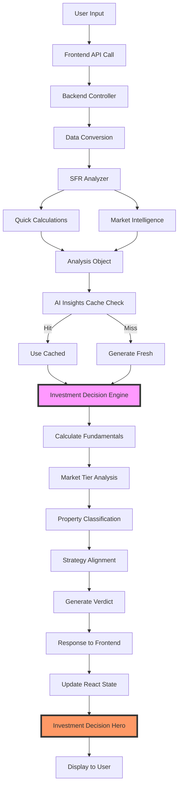

# Real Estate Analysis Workflow & Data Flow Documentation

**Version**: 1.0  
**Last Updated**: January 2025  
**Purpose**: Complete step-by-step workflow showing how data flows through the system during property analysis

---

## 📊 Complete Analysis Workflow

### **Overview**
```
User Input → Backend Analysis → Investment Decision → Frontend Display
```

---

## 🔄 Detailed Data Flow Steps

### **Step 1: User Input Collection**
**Location**: Frontend - Property Wizard or SFR Form  
**Components**: 
- `/frontend/src/components/PropertyWizard/`
- `/frontend/src/components/SFRAnalysis/SFRPropertyForm.tsx`

**Data Collected**:
```javascript
{
  // Basic Property Info
  propertyAddress: string,
  purchasePrice: number,
  monthlyRent: number,
  
  // Financing
  downPayment: number,
  interestRate: number,
  loanTerm: number,
  
  // Expenses
  propertyTaxRate: number,
  insuranceRate: number,
  maintenanceCost: number,
  propertyManagementRate: number,
  
  // Strategy (Step 4 of Wizard)
  exitStrategy: {
    primaryExitStrategy: 'sale' | 'refinance' | '1031' | 'estate' | 'flexible',
    portfolioStrategy: 'first' | 'cashflow' | 'appreciation' | 'balanced',
    riskApproach: 'conservative' | 'balanced' | 'aggressive',
    holdPeriod: number
  }
}
```

---

### **Step 2: Frontend API Call**
**Location**: `/frontend/src/pages/SFRAnalysis.tsx`  
**Function**: `handleApplyChanges()` (line ~240)  
**Endpoint**: `POST /api/deals/analyze`

**Request Payload**:
```javascript
{
  ...propertyData,
  isInteractiveUpdate: true,  // For re-analysis
  skipAI: false,              // For quick calculations
  enhancedGoals: {            // From Step 4
    exitStrategy,
    portfolioStrategy,
    experienceLevel,
    riskTolerance
  }
}
```

---

### **Step 3: Backend Controller Processing**
**Location**: `/backend/src/controllers/deals.ts`  
**Function**: `analyzeDeal()` (line ~365)

**Processing Steps**:
1. **Data Conversion**: `convertWizardData()` - Converts wizard format to standard format
2. **Validation**: Checks required fields
3. **Extract Assumptions**: Pull out projection parameters

**Data State**:
```javascript
dealData = {
  ...convertedData,
  longTermAssumptions: {
    projectionYears: 10,
    annualRentIncrease: 2,
    annualExpenseIncrease: 2,
    annualPropertyValueIncrease: 3
  }
}
```

---

### **Step 4: Core Financial Analysis**
**Location**: `/backend/src/services/SFRAnalyzer.ts`  
**Function**: `analyzeWithMarketIntelligence()` (line ~50)

**Sub-processes**:
1. **Quick Calculation Service** (`/backend/src/services/quickCalculationService.ts`)
   - Calculates: NOI, cap rate, cash flow, DSCR
   - Returns in <50ms

2. **Market Intelligence Service** (`/backend/src/services/marketIntelligenceService.ts`)
   - Fetches FRED data (cached)
   - Fetches RentCast data (cached)
   - Fetches Census data (cached)

**Analysis Object Created**:
```javascript
analysis = {
  monthlyAnalysis: {
    cashFlow: 464,  // Example from your test
    income: {...},
    expenses: {...}
  },
  keyMetrics: {
    capRate: 3.48,  // Your test showed this
    cashOnCashReturn: 3.34,
    noi: 7000,
    dscr: 0.98
  },
  marketData: {...},
  longTermAnalysis: {...}
}
```

---

### **Step 5: AI Insights Generation (Optional)**
**Location**: `/backend/src/controllers/deals.ts`  
**Function**: `generateAIInsights()` (line ~115)

**Cache Check**:
```javascript
// Check cache first
const cached = await AIInsightsCacheService.getCachedInsights(dealData);
if (cached) return cached.insights;

// Generate fresh if not cached
const insights = await getAIInsights(dealData, analysis);
```

**Note**: AI insights are for additional analysis, NOT for investment decision

---

### **Step 6: Investment Decision Engine** ⚠️ **CRITICAL STEP**
**Location**: `/backend/src/services/investment/investmentDecisionEngine.ts`  
**Function**: `generateInvestmentDecision()` (line ~75)

**Sub-processes** (Sequential):

#### **6.1: Calculate Fundamentals**
```javascript
fundamentals = {
  capRate: 3.48,
  cashFlow: 464,
  cashOnCashReturn: 3.34,
  dscr: 0.98
}
```

#### **6.2: Market Intelligence Analysis (Phase 2A)**
**Location**: `/backend/src/services/investment/marketTierService.ts`
```javascript
marketIntelligence = {
  marketTier: { tier: 2, name: "Balanced Growth Market" },
  fairMarketValue: 340000,
  overpriced: true,
  overpricedBy: 18
}
```

#### **6.3: Property Classification (Phase 2B)**
**Location**: `/backend/src/services/investment/propertyClassificationService.ts`
```javascript
propertyClassification = {
  propertyClass: 'B',
  confidence: 80,
  riskLevel: 'medium',
  managementIntensity: 'medium'
}
```

#### **6.4: Strategy Alignment (Phase 3)**
**Location**: `/backend/src/services/investment/strategyAlignmentService.ts`
```javascript
strategyAlignment = {
  alignmentScore: 65,
  alignment: 'FAIR',
  misalignments: [...],
  recommendations: [...]
}
```

#### **6.5: Generate Verdict**
**Logic Flow**:
```javascript
// Uses analysis.monthlyAnalysis.cashFlow (line 1304)
const mainMonthlyCashFlow = analysis.monthlyAnalysis?.cashFlow || 0;  // 464 in your case

// Decision tree (simplified):
if (rentToPriceRatio < 0.5%) → PASS
else if (price > walkAwayPrice * 1.1) → PASS  
else if (capRate < marketThreshold) → PASS  // YOUR CASE: 3.48% < threshold
else if (cashFlow < 0 && !leverageOptions) → PASS
else if (cashFlowBuffer.isCritical) → PASS
else if (tooGoodToBeTrue) → NEGOTIATE
else if (cashFlow > 0 && capRate < negotiateThreshold) → NEGOTIATE
else if (cashFlow > 1500 && capRate > 5%) → BUY
else → NEGOTIATE (default)
```

**Investment Decision Object**:
```javascript
investmentDecision = {
  verdict: 'PASS',
  confidence: 45,
  score: 35,
  primaryReason: "Cap rate of 3.5% is 150bps below Balanced Growth Market threshold",  // Backend generated
  secondaryReasons: [
    "Class B - Standard investment-grade property (80% classification confidence)",
    "Overpaying reduces returns and increases downside risk"
  ],
  keyRisks: [...],
  actionPlan: [...]
}
```

---

### **Step 7: Response to Frontend**
**Location**: `/backend/src/controllers/deals.ts` (line ~520)
**Response Structure**:
```javascript
{
  ...analysis,
  investmentDecision: {
    verdict: 'PASS',
    primaryReason: "Cap rate of 3.5% is below market threshold",  // From backend
    // ... other fields
  },
  aiInsights: {...}
}
```

---

### **Step 8: Frontend State Update**
**Location**: `/frontend/src/pages/SFRAnalysis.tsx`
**Function**: `handleApplyChanges()` (line ~267)
```javascript
setAnalysis(response.data);  // Updates React state with new analysis
```

---

### **Step 9: Frontend Display** ⚠️ **PROBLEM AREA**
**Location**: `/frontend/src/components/SFRAnalysis/InvestmentDecisionHero.tsx`

**Current Issue** (line ~211):
```javascript
// Frontend OVERRIDES backend's primaryReason!
safeMessage = InvestmentMessagingEngine.generateMessage(
  investmentDecision.verdict,
  goalContext,
  metrics
);
// This generates: "Property metrics do not meet minimum investment thresholds"
// Instead of using: investmentDecision.primaryReason from backend
```

**The Fix Needed**:
```javascript
// Preserve backend's sophisticated reasoning
safeMessage = {
  ...generatedMessage,
  primaryReason: investmentDecision.primaryReason  // Use backend's reason
};
```

---

## 🔍 Debugging Checklist

When investigating issues like "stale data" or "wrong verdict":

### **1. Check User Input**
- [ ] Log `propertyData` in frontend before API call
- [ ] Verify `isInteractiveUpdate` flag is set for re-analysis

### **2. Check Backend Reception**
- [ ] Log received `req.body` in `analyzeDeal()`
- [ ] Verify data conversion is correct

### **3. Check Core Analysis**
- [ ] Log `analysis.monthlyAnalysis.cashFlow`
- [ ] Log `analysis.keyMetrics.capRate`
- [ ] Verify calculations are using updated data

### **4. Check Investment Decision**
- [ ] Log `mainMonthlyCashFlow` in verdict generation (line 1304)
- [ ] Log which verdict path is taken
- [ ] Log final `primaryReason` generated

### **5. Check Frontend Display**
- [ ] Log `investmentDecision.primaryReason` received from backend
- [ ] Log `safeMessage.primaryReason` after frontend processing
- [ ] Verify frontend isn't overriding backend logic

---

## 🐛 Known Issues

### **Issue #1: Frontend Overrides Backend Reasoning**
**Symptom**: Generic message "Property metrics do not meet minimum investment thresholds"  
**Cause**: `InvestmentMessagingEngine.generateMessage()` creates its own primaryReason  
**Fix**: Use `investmentDecision.primaryReason` from backend directly

### **Issue #2: Cap Rate Threshold Not Market-Relative**
**Symptom**: Property with positive cash flow still gets PASS verdict  
**Cause**: Cap rate (3.48%) below market threshold despite positive cash flow  
**Fix**: Already implemented in Phase 2A - verify thresholds are appropriate

---

## 📈 Performance Metrics

| Step | Component | Target Time | Actual Time |
|------|-----------|------------|-------------|
| Quick Calc | `quickCalculationService` | <50ms | ~30ms |
| Market Data | `marketIntelligenceService` | <200ms | ~150ms (cached) |
| Investment Decision | `investmentDecisionEngine` | <100ms | ~80ms |
| AI Insights | `aiService` | <5s | ~3s (cached: 0ms) |
| **Total** | End-to-end | <6s | ~4s typical |

---

## 🔄 Data Flow Diagram



---

## 🚀 Reusability Guidelines

### **Adding New Analysis Factors**
1. Add calculation in `SFRAnalyzer.analyzeWithMarketIntelligence()`
2. Include in `analysis` object
3. Use in `InvestmentDecisionEngine.generateVerdict()`
4. Display in frontend components

### **Adding New Verdict Scenarios**
1. Add logic in `InvestmentDecisionEngine.generateVerdict()` (line ~1340)
2. Follow existing pattern: condition → verdict → primaryReason
3. Test with comprehensive test matrix

### **Adding New Market Tiers**
1. Update `MarketTierService` classifications
2. Adjust thresholds in `getCapRateThreshold()`
3. Test with properties in new markets

---

## 📝 Quick Reference

**Key Files**:
- Frontend Entry: `/frontend/src/pages/SFRAnalysis.tsx`
- Backend Entry: `/backend/src/controllers/deals.ts`
- Decision Logic: `/backend/src/services/investment/investmentDecisionEngine.ts`
- Display Logic: `/frontend/src/components/SFRAnalysis/InvestmentDecisionHero.tsx`

**Key Functions**:
- `analyzeDeal()` - Main backend orchestrator
- `generateInvestmentDecision()` - Verdict generator
- `handleApplyChanges()` - Frontend re-analysis trigger
- `InvestmentMessagingEngine.generateMessage()` - Frontend message override (PROBLEM)

---

*This document should be updated whenever the analysis workflow changes.*