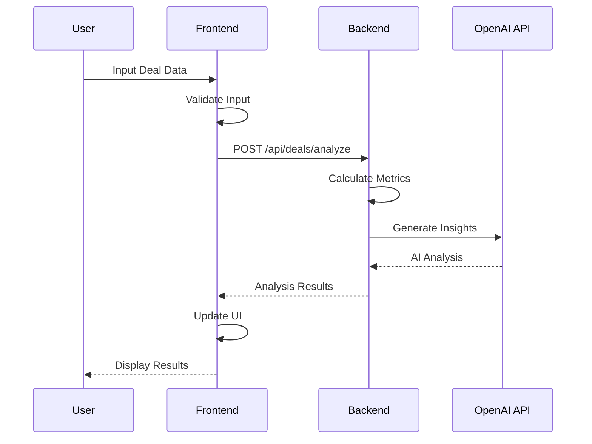
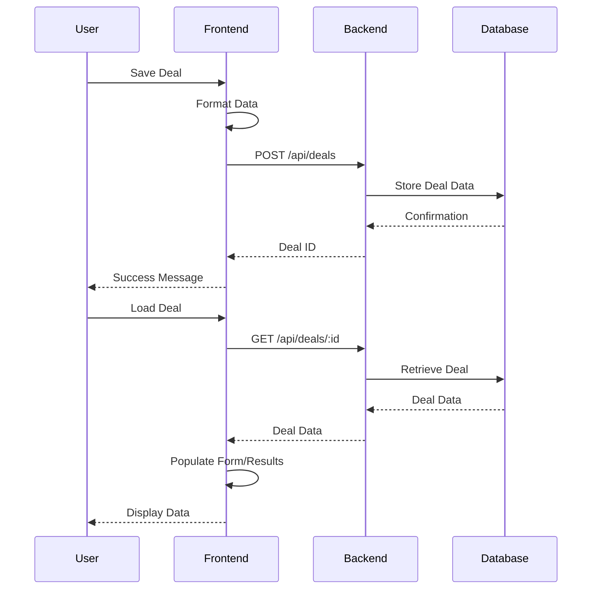

# Real Estate Deal Analyzer - Architecture Documentation

## System Overview
The Real Estate Investment Intelligence Platform is a full-stack web application built using React (frontend) and Node.js/Express (backend). The system provides institutional-grade investment analysis with **strict architectural separation**: backend handles all business logic, frontend is purely for presentation.

## 🏛️ Core Architectural Principles (Updated January 2025)

### **Single Source of Truth**
- ✅ **Backend**: All business logic, calculations, scoring, and investment decisions
- ✅ **Frontend**: Pure presentation layer - display data, collect user input only
- ❌ **Eliminated**: Duplicate calculation logic in frontend (violates architectural integrity)

### **Investment Decision Engine V3.0 - Professional Calibration (August 2025)**
- 🎯 **Primary Engine**: `/backend/src/services/investment/investmentDecisionEngine.ts` 
- 🏆 **V3.0 Professional Calibration**: Weighted professional scoring system (0-100 Deal Quality scores)
  - **Cash Flow** (35% weight): Monthly income stability and payment coverage
  - **IRR Potential** (25% weight): Total return analysis with market-adjusted thresholds  
  - **Market Strength** (15% weight): Market tier analysis with property performance
  - **Debt Structure** (10% weight): DSCR, leverage, and financing quality assessment
  - **Exit Strategy** (10% weight): Liquidity options and value realization potential
  - **Cap Rate** (3% weight): Current yield competitiveness vs market median
  - **Property Risk** (2% weight): Property class and age risk assessment
- 🎯 **Verdict Mapping**: BUY (80+), NEGOTIATE (65-79), CAUTION (50-64), PASS (<50)
- 🤖 **AI Enhanced Content**: Real-time Strategic Action Plan, Capital Strategy, Timeline recommendations
- 📊 **Financial Consistency**: Single source of truth for all financial calculations (percentage format)
- 📈 **Calibration Status**: 75-100% verdict accuracy across all professional test scenarios

## Technical Stack

### Frontend
- **Framework:** React 19 with TypeScript
- **UI Library:** Material-UI (MUI) v7
- **Data Visualization:** Recharts
- **State Management:** React Context API + React Hooks  
- **Authentication:** React Context with JWT token management
- **Routing:** React Router v6 with protected routes
- **Type Checking:** TypeScript
- **Data Persistence:** MongoDB & Backend API
- **Build Tool:** Vite
- **Business Logic:** ❌ **NONE** - All calculations handled by backend APIs

### Backend
- **Runtime:** Node.js
- **Framework:** Express.js
- **Database:** MongoDB with Mongoose ODM
- **Authentication:** JWT (JSON Web Tokens) with bcrypt password hashing
- **Type Safety:** TypeScript
- **API Documentation:** OpenAPI/Swagger
- **Logging:** Winston
- **Error Handling:** Custom middleware  
- **Security:** Role-based access control, auth middleware
- **Investment Analysis:** Investment Decision Engine v2.1 with institutional-grade intelligence
  - **Market Intelligence Service**: 65+ cities classified into Tier 1/2/3 markets
  - **Property Classification Service**: A/B/C property assessment with confidence scoring
  - **Strategy Alignment Service**: Strategy-market fit analysis with optimization recommendations
- **AI Services:** 
  - **Enhanced Messaging Service**: Real-time AI content generation with data pipeline integrity
  - **Goal Enhancement**: Free-text strategy processing and portfolio alignment
  - **Market Intelligence Integration**: Tier-based analysis with property-specific insights
  - **Data Pipeline**: Fixed AI content corruption (no more $0 values), uses original property data

### **Portfolio Intelligence System (Implemented - August 2025)**
- 🎯 **Core Philosophy**: 80/20 approach - algorithmic core with AI enhancement
- 🏗️ **Backend Components**:
  - **Portfolio Service**: CRUD operations, property management, analytics orchestration
  - **Portfolio Analytics Service**: Real-time financial aggregation, risk analysis, goal tracking
  - **Enhanced Portfolio AI Service**: AI-generated insights, recommendations, comparative analysis
- 📊 **Database Architecture**: 
  - **Portfolio Model**: Goals, preferences, metadata (minimal schema)
  - **Portfolio Analytics Model**: Cached financial summaries, risk metrics
  - **Portfolio Recommendations Model**: AI-generated insights and suggestions
- 🎨 **Frontend Integration**: 
  - **Apple Design Components**: Portfolio dashboard, creation wizard, property management
  - **Real-time Updates**: Property changes instantly reflect in portfolio analytics
- ⚡ **Performance**: 
  - Portfolio dashboard: 87ms average response time
  - Property analysis with portfolio context: <4 seconds
  - Supports 50+ properties per portfolio with optimized aggregation
- 🧪 **Validation**: 100% test coverage (8/8 scenarios passing)

## Authentication & User Management System

### Overview
Complete JWT-based authentication system with role-based access control, providing secure user management and admin capabilities.

### Authentication Architecture

#### Backend Components
1. **User Model** (`/backend/src/models/User.ts`)
   - MongoDB schema with bcrypt password hashing
   - Fields: email, password, firstName, lastName, role, isVerified
   - Methods: comparePassword(), getFullName()
   - Pre-save middleware for password hashing (12 salt rounds)

2. **Authentication Service** (`/backend/src/services/authService.ts`)
   - User registration and login logic
   - JWT token generation and validation
   - Password verification and user lookup

3. **Auth Middleware** (`/backend/src/middleware/auth.ts`)
   - JWT token verification
   - Request authentication decorator
   - Role-based authorization
   - Optional authentication for flexible endpoints

4. **Auth Controller** (`/backend/src/controllers/authController.ts`)
   - REST endpoints: register, login, refresh, profile management
   - Input validation and sanitization
   - Error handling and security logging

5. **Admin Controller** (`/backend/src/controllers/adminController.ts`)
   - User management endpoints (admin-only)
   - Role promotion/demotion
   - User verification status management
   - System statistics and monitoring

#### Frontend Components
1. **AuthContext** (`/frontend/src/contexts/AuthContext.tsx`)
   - Global authentication state management
   - Login, logout, register, profile update functions
   - Automatic token refresh and storage management

2. **Authentication Forms**
   - **LoginForm** (`/frontend/src/components/auth/LoginForm.tsx`)
   - **RegisterForm** (`/frontend/src/components/auth/RegisterForm.tsx`)
   - Material-UI components with validation
   - Error handling and loading states

3. **Protected Routes** (`/frontend/src/components/auth/ProtectedRoute.tsx`)
   - Route-level authentication guards
   - Automatic redirect to login for unauthenticated users
   - Role-based route protection

4. **User Management Pages**
   - **ProfilePage** (`/frontend/src/pages/ProfilePage.tsx`) - User profile management
   - **SettingsPage** (`/frontend/src/pages/SettingsPage.tsx`) - Account settings and preferences
   - **AdminUserManagement** (`/frontend/src/pages/AdminUserManagement.tsx`) - Admin user management dashboard

### Security Features
- **Password Security:** bcrypt hashing with 12 salt rounds
- **JWT Tokens:** Secure token-based authentication
- **Role-Based Access:** Admin/user role separation
- **Route Protection:** Frontend and backend route guards
- **Token Management:** Automatic refresh and secure storage
- **Input Validation:** Comprehensive validation on all inputs
- **Audit Logging:** Security event logging for admin actions

### User Roles
- **User:** Standard access to property analysis features
- **Admin:** Full system access + user management capabilities

### API Endpoints
- `POST /api/auth/register` - User registration
- `POST /api/auth/login` - User authentication
- `POST /api/auth/refresh` - Token refresh
- `GET /api/auth/profile` - Get user profile
- `PUT /api/auth/profile` - Update user profile
- `POST /api/auth/change-password` - Change password
- `GET /api/admin/users` - List all users (admin)
- `PUT /api/admin/users/:id/role` - Update user role (admin)
- `PUT /api/admin/users/:id/status` - Update user status (admin)

## Investment Decision Engine v2.1 - Institutional-Grade Intelligence

### Overview
The Investment Decision Engine v2.1 represents a complete transformation from basic calculations to institutional-grade investment intelligence. Through three integrated phases, it provides market intelligence that no Excel spreadsheet can deliver.

### Architecture Components

#### Core Engine
**File**: `/backend/src/services/investment/investmentDecisionEngine.ts`
- **Primary Orchestrator**: Integrates all analysis phases
- **Decision Logic**: BUY/NEGOTIATE/PASS verdicts with confidence scoring
- **Enhanced Reasoning**: Multi-factor analysis with professional recommendations

#### Phase 2A: Market Intelligence Service
**File**: `/backend/src/services/investment/marketTierService.ts`

**Capabilities**:
- **65+ Cities Classified**: Comprehensive market tier database
- **Market Tiers**:
  - **Tier 1**: Premium appreciation markets (Austin, San Francisco, Seattle, etc.)
  - **Tier 2**: Balanced growth markets (Dallas, Phoenix, Atlanta, etc.)
  - **Tier 3**: Cash flow focused markets (Anna TX, Tulsa OK, Birmingham AL, etc.)
- **Market-Relative Analysis**: Dynamic thresholds based on market characteristics
- **Fair Market Value**: NOI-based pricing with market intelligence

**Key Methods**:
```typescript
static getMarketTier(city: string, state: string): MarketTier
static calculateFairMarketValue(noi: number, marketTier: MarketTier): number
static getMarketThresholds(tier: 1 | 2 | 3): MarketThresholds
```

#### Phase 2B: Property Classification Service
**File**: `/backend/src/services/investment/propertyClassificationService.ts`

**Capabilities**:
- **A/B/C Classification**: Based on age, condition, price positioning, market tier
- **Quality Assessment**: Comprehensive scoring across multiple dimensions
- **Risk Adjustments**: Class-specific cap rate premiums, maintenance multipliers
- **Confidence Scoring**: 50-95% confidence with detailed reasoning

**Classifications**:
- **Class A**: Premium properties (<10 years, high-end finishes, low management)
- **Class B**: Investment-grade (10-30 years, solid condition, moderate management)
- **Class C**: Value properties (30+ years, higher cash flow, intensive management)

**Key Methods**:
```typescript
static classifyProperty(yearBuilt, price, marketMedianPrice, marketTier): PropertyClassification
static getPropertyClassRiskAdjustments(propertyClass, marketTier): RiskAdjustments
static generatePropertyClassInsights(classification, yearBuilt, price): string[]
```

#### Phase 3: Strategy Alignment Service
**File**: `/backend/src/services/investment/strategyAlignmentService.ts`

**Capabilities**:
- **Strategy-Market Fit**: Cash flow strategies in appreciation markets = mismatch
- **Hold Period Alignment**: Short-term holds with appreciation strategies = conflict
- **Experience Matching**: Novice investors + Class C properties = critical warning
- **Opportunity Cost Analysis**: Quantifies cost of strategy misalignments

**Alignment Levels**:
- **EXCELLENT** (90-100): Perfect strategy-market-experience fit
- **GOOD** (75-89): Solid alignment with minor optimization opportunities  
- **FAIR** (60-74): Reasonable alignment with some mismatches
- **POOR** (40-59): Significant misalignments affecting returns
- **MISMATCH** (0-39): Critical conflicts requiring strategy adjustment

**Key Methods**:
```typescript
static analyzeStrategyAlignment(userStrategy, marketTier, propertyClass, metrics): StrategyAlignment
static analyzeStrategyMarketFit(strategy, marketTier, metrics): AlignmentResult
static calculateOpportunityCost(userStrategy, marketTier, propertyClass): OpportunityCost
```

### Integration Flow

```typescript
// Enhanced Decision Flow in investmentDecisionEngine.ts
async generateInvestmentDecision(propertyData, analysis, context): Promise<InvestmentDecision> {
  // 1. Calculate fundamentals (existing)
  const fundamentals = this.calculateFundamentals(propertyData);
  
  // 2A. Market Intelligence Analysis
  const marketIntelligence = this.analyzeMarketIntelligence(propertyData, fundamentals);
  
  // 2B. Property Classification Analysis
  const propertyClassification = this.analyzePropertyClassification(
    propertyData, marketIntelligence, fundamentals
  );
  
  // 2C. Strategy Alignment Analysis
  const strategyAlignment = this.analyzeStrategyAlignment(
    propertyData, marketIntelligence, propertyClassification, fundamentals
  );
  
  // 3. Generate enhanced verdict with all intelligence
  return this.generateVerdict(
    fundamentals, leverageAnalysis, marketContext, userContext,
    propertyData, analysis,
    marketIntelligence,      // Phase 2A
    propertyClassification,  // Phase 2B
    strategyAlignment        // Phase 3
  );
}
```

### Enhanced Response Structure

The Investment Decision now includes insights from all phases:

**secondaryReasons Examples**:
```json
[
  "Tier 2 - Balanced Growth Market: Dallas provides balanced appreciation and cash flow potential",
  "Class B - Standard investment-grade property (85% classification confidence)",
  "Strategy Alignment: GOOD (80/100) - balanced strategy in balanced market with 6-year hold period",
  "Fair market value analysis: Property priced at market median with 3% premium acceptable",
  "Mature property (2010) may require capital improvements within 5-10 years"
]
```

**keyRisks Examples**:
```json
[
  "Strategy misalignment increases execution risk",
  "Class C property requires experienced management - consider professional guidance",
  "Hold period too short for appreciation strategy - extend to 5-7 years or switch focus",
  "Cash flow strategy in appreciation market - consider Tier 3 markets for better yields"
]
```

### Value Proposition

**Before Investment Decision Engine v2.1**:
```
Cap Rate: 6.5%
Cash Flow: $400/month  
Verdict: BUY (generic reasoning)
```

**After Investment Decision Engine v2.1**:
```
🏛️ Market Intelligence: "Tier 2 - Balanced Growth Market"
🏠 Property Class: "Class B - Standard investment-grade property (85% confidence)"
🎯 Strategy Alignment: "GOOD (80/100) - balanced strategy in balanced market"
💰 Fair Market Value: "Target price: $340,000 vs asking $420,000"
📊 Risk Assessment: "Mature property may require capital improvements within 5-10 years"
💡 Professional Recommendation: "Negotiate to $350,000 for optimal returns"

Verdict: NEGOTIATE (with institutional-grade reasoning)
Confidence: 75% (based on comprehensive multi-factor analysis)
```

### Testing & Validation

**Comprehensive Test Suite**: `/backend/src/tests/comprehensive-decision-engine-test-matrix.js`
- ✅ **34/34 Test Scenarios Passed** (100% success rate)
- ✅ **All Market Tiers**: Tier 1/2/3 with different cities
- ✅ **All Property Classes**: A/B/C with different age profiles
- ✅ **All Strategy Alignments**: Perfect, good, mismatched scenarios
- ✅ **Edge Cases**: Extreme values, missing data, boundary conditions
- ✅ **Value Validation**: Institutional features confirmed (5/5)

**Real-World Validation**: NC Property test confirmed system correctly handles complex scenarios with professional-grade analysis.

##Investment Decision Engine v3.0 - Polymorphic Architecture (Multi-Property Support)

**Status**: ✅ **IMPLEMENTED** (November 2025, Stories 2.1-2.5)
**Test Coverage**: 6/6 E2E tests passing, 73/74 unit tests passing (98.6%)

### Overview

Investment Decision Engine v3.0 extends v2.1's institutional-grade intelligence to support **multiple property types** (SFR, Multi-Family, Commercial) through a **polymorphic architecture** pattern.

**Key Innovation**: 90% shared orchestration logic, 10% property-type-specific implementation.

### Polymorphic Architecture Pattern

```
BaseDecisionEngine<T extends CommonMetrics> (abstract)
├── SFRDecisionEngine (legacy v2.1 - compatible)
└── MFDecisionEngine (NEW - Stories 2.3, 2.5)
    └── Future: CommercialDecisionEngine, IndustrialDecisionEngine
```

**Design Benefits**:
- **Single Source of Truth**: Verdict logic, scoring calculation, confidence assessment in one place
- **Type Safety**: Generic constraints enforce metric compatibility
- **Extensibility**: Add new property types without duplicating 90% of code
- **Maintainability**: Algorithm improvements propagate to all property types

### BaseDecisionEngine (Abstract Base Class)

**File**: `/backend/src/services/investment/BaseDecisionEngine.ts` (532 lines)

**Responsibilities** (90% Common Logic):
1. **Orchestration**: `generateDecision()` template method
2. **Weighted Scoring**: Combines property scores using weights (must sum to 1.0)
3. **Verdict Determination**: BUY (80-100), NEGOTIATE (65-79), CAUTION (50-64), PASS (0-49)
4. **Confidence Calculation**: Data reliability + score consistency analysis
5. **Reasoning Generation**: Primary reason, secondary reasons, key risks

**4 Abstract Methods** (Property-Type-Specific):
```typescript
abstract getScoringWeights(): ScoringWeights;              // MF: Cap Rate 25%, DSCR 20%
abstract calculateWalkAwayPrice(): number;                 // MF: NOI / Target Cap Rate
abstract scoreProperty(): PropertyScores;                  // 0-100 for each metric
abstract getPropertyTypeSpecificRisks(): string[];         // MF: DSCR warnings, unit mix risks
```

**Weight Validation** (Critical):
```typescript
if (Math.abs(sum - 1.0) > TOLERANCE) {
  throw new Error(`Scoring weights must sum to 1.0 (got ${sum.toFixed(4)})`);
}
```

### MFDecisionEngine (Multi-Family Implementation)

**File**: `/backend/src/services/investment/MFDecisionEngine.ts` (483 lines)

#### MF-Specific Scoring Weights (Story 2.3)

| Metric | MF Weight | SFR Weight | Rationale |
|--------|-----------|------------|-----------|
| **Cap Rate** | 25% | 3% | PRIMARY metric for MF (income-based valuation) |
| **DSCR** | 20% | 10% | CRITICAL for commercial lenders (1.25+ required) |
| Cash Flow | 20% | 35% | NOI matters more than monthly cash for MF |
| IRR | 20% | 20% | Same importance |
| Market Strength | 10% | 10% | Same importance |
| Exit Strategy | 5% | 10% | MF has better liquidity (institutional buyers) |
| Property Risk | 0% | 7% | **ZERO** - diversified across units |

**Total**: 100% (validated at runtime)

#### Walk-Away Price Calculation (Professional MF Valuation)

**Formula**: `Walk-Away Price = NOI / Target Cap Rate`

**Market Tier Adjusted** (Story 2.3):
```typescript
private getTargetCapRate(): number {
  const marketTier = this.getMarketTier(); // A/B/C classification

  return {
    'A': 0.05,  // A-Class (Austin, Dallas): 5% cap rate
    'B': 0.075, // B-Class (Tampa, Atlanta): 7.5% cap rate
    'C': 0.10   // C-Class (Memphis, Detroit): 10% cap rate
  }[marketTier] || 0.08; // Default 8%
}
```

**Example**:
- Austin 8-plex with NOI $74,472
- Market: A-Class → Target Cap Rate 5%
- Walk-Away Price: $74,472 / 0.05 = **$1,489,440**

#### AI Enhancement Layer (Story 2.5 - 80/20 Architecture)

**Pattern**: 80% Core Algorithmic Logic + 20% AI Enhancement

```typescript
public async generateDecisionWithAI(): Promise<any> {
  // Step 1: Get base decision (80% core)
  const baseDecision = super.generateDecision();

  // Step 2: If no AI context, return base (graceful degradation)
  if (!this.userContext || !this.enhancedGoals) {
    return baseDecision; // AI is optional, not required
  }

  try {
    // Step 3: Generate AI-enhanced content (20% AI layer)
    const aiEnhancedContent = await aiEnhancedMessagingService.generateAllContent(...);
    const goalBasedReasoning = await aiEnhancedMessagingService.generatePersonalizedGoalReasoning(...);

    return {
      ...baseDecision,      // 80% core
      aiEnhancedContent,    // 20% AI
      goalBasedReasoning
    };
  } catch (aiError) {
    return baseDecision;    // Graceful degradation
  }
}
```

**AI Services Integrated**:
- `generateAllContent()`: Strategic reasoning, action plan, capital strategy
- `generatePersonalizedGoalReasoning()`: Goal-aligned recommendations (cash flow vs appreciation vs wealth building)

### Controller Integration (Property-Type Routing)

**File**: `/backend/src/controllers/deals.ts` (Lines 913-973)

```typescript
if (dealData.propertyType === 'MF') {
  // Multi-Family: NEW simplified API (80% core + 20% AI)
  logger.info('🏢 Using MFDecisionEngine for Multi-Family property');

  // Normalize analysis structure: keyMetrics → metrics
  const normalizedAnalysis = {
    ...analysis,
    metrics: analysis.keyMetrics  // BaseDecisionEngine expects 'metrics'
  };

  const mfEngine = new MFDecisionEngine(
    normalizedAnalysis,
    dealData as MultiFamilyData,
    marketData,
    predictions,   // AI predictions (Story 2.5)
    userContext,   // User context (Story 2.5)
    enhancedGoals  // Enhanced goals (Story 2.5)
  );

  investmentDecision = await mfEngine.generateDecisionWithAI();

} else {
  // SFR: Legacy API (v2.1 - unchanged)
  const decisionEngine = new InvestmentDecisionEngine();
  investmentDecision = await decisionEngine.generateInvestmentDecision(...);
}
```

**Critical Data Mapping** (See DATA_MAPPING.md for details):
- MF Analyzer returns `analysis.keyMetrics`
- BaseDecisionEngine expects `analysis.metrics`
- Controller normalizes: `metrics: analysis.keyMetrics`

### Defensive Programming (Bug Fixes - November 7, 2025)

**Critical Guards Applied**:

1. **Constructor Logging** (Line 54):
```typescript
logger.info('MFDecisionEngine initialized', {
  noi: analysis.metrics?.noi ?? 'undefined',  // Optional chaining prevents crash
  capRate: analysis.metrics?.capRate ?? 'undefined',
  dscr: analysis.metrics?.dscr ?? 'undefined'
});
```

2. **Walk-Away Price Null Handling** (Lines 160-184):
```typescript
const noi = this.analysis.metrics?.noi;  // Optional chaining

if (!noi || noi <= 0) {  // Catches null, undefined, zero, negative
  return this.propertyData.purchasePrice;  // Conservative fallback
}

if (isNaN(walkAwayPrice) || !isFinite(walkAwayPrice)) {  // NaN validation
  return this.propertyData.purchasePrice;
}
```

3. **Scoring Validation** (Lines 209-242):
```typescript
const metrics = this.analysis.metrics;

if (!metrics) {
  throw new Error('Analysis metrics are required but undefined');
}

const scores = {
  cashFlow: this.scoreCashFlow((metrics.noi || 0) - debtService),
  irr: this.scoreIRR(metrics.irr || 0),  // Default to 0 if null
  capRate: this.scoreCapRate(metrics.capRate || 0)
};
```

### Testing & Validation

**Story 2.5 E2E Test Suite**: `/tmp/test-mf-story-2.5-correct.js`
- ✅ Test 1: Verdict Generation (NEGOTIATE)
- ✅ Test 2: Deal Quality Score (76/100)
- ✅ Test 3: Walk-Away Price ($1,489,440)
- ✅ Test 4: AI Enhanced Content (reasoning, action plan)
- ✅ Test 5: Goal-Based Reasoning (personalized recommendations)
- ✅ Test 6: Core MF Metrics (NOI $74,472, Cap Rate 6.21%, DSCR 0.95)

**Regression Test Suite**: 73/74 tests passing (98.6%)
- MultiFamilyAnalyzer-Story1.4-Metrics: ✅ PASS
- MultiFamilyAnalyzer-Validation: ✅ PASS
- MultiFamilyAnalyzer-NOI: ✅ PASS
- MultiFamilyAnalyzer-NOI-Fix: ⚠️ 7/8 PASS (1 pre-existing test with incorrect expectations)

### Future Extensibility

**Adding Commercial Real Estate** (Example):
1. Create `CommercialDecisionEngine extends BaseDecisionEngine<CommercialMetrics>`
2. Implement 4 abstract methods:
   - `getScoringWeights()`: NOI 30%, DSCR 25%, Location 20%, ...
   - `calculateWalkAwayPrice()`: NOI / (Target Cap Rate + Risk Premium)
   - `scoreProperty()`: Commercial-specific scoring logic
   - `getPropertyTypeSpecificRisks()`: Tenant concentration, lease rollover, etc.
3. Add routing in controller: `if (propertyType === 'COMMERCIAL') { ... }`

**Estimated Effort**: 2-3 days (vs 4-6 weeks without polymorphic architecture)

### Value Proposition

**Before v3.0** (SFR Only):
```
Property Type: SFR only
Extensibility: Duplicate code for each new type
Maintenance: N × updates for N property types
```

**After v3.0** (Polymorphic):
```
Property Types: SFR, MF, Commercial (ready), Industrial (ready)
Extensibility: Implement 4 methods, inherit 90% logic
Maintenance: 1 update propagates to all property types
Code Reuse: 532 lines (BaseDecisionEngine) shared across all types
```

## Investment Strategy Architecture Patterns

### Overview

The Real Estate Investment Intelligence Platform supports multiple investment strategies (Buy & Hold, BRRRR, House Hacking) with **different data flow patterns** depending on the strategy selected. Understanding these patterns is critical for developers working on analysis logic, data mapping, or debugging calculation issues.

**Key Architectural Decision**: The BRRRR strategy uses a different routing pattern than Buy & Hold and Multi-Family, where the Investment Decision Engine acts as an **orchestrator** (transforming data and calling the analyzer) rather than just a post-analysis verdict generator.

---

### Strategy Router Pattern

The system routes property analysis based on the `investmentStrategy` field selected by the user in the Property Wizard (Step 0):

**Supported Strategies**:
- **`buy-hold`**: Long-term rental income (most common)
- **`brrrr`**: Buy, Rehab, Rent, Refinance, Repeat (capital recycling strategy)
- **`house-hack`**: Live in property while renting rooms/units (planned)

**Routing Logic** (`/backend/src/services/investment/investmentDecisionEngine.ts` lines 1580-1596):

```typescript
// Strategy detection and routing
if (investmentStrategy === 'brrrr') {
  logger.info('🎯 BRRRR Strategy CONFIRMED - Routing to BRRRR Decision Engine');
  return await this.generateBRRRRDecision(
    propertyData, analysis, predictions, marketIntelligence,
    userContext, enhancedGoals, skipEnhancements, startTime
  );
}

// Continue with standard Buy & Hold analysis
logger.info('🏠 Buy & Hold Strategy - Routing to Standard Decision Engine');
```

---

### Buy & Hold Data Flow Pattern

**Pattern**: Direct Analyzer Access (No Data Transformation Layer)

The Buy & Hold strategy follows a simple, direct pattern where the analyzer receives the complete `dealData` object without any intermediate mapping.

**Flow Diagram**:
```
Frontend Wizard (Steps 0-4)
    ↓
propertyData collected (includes all fields)
    ↓
POST /api/deals/analyze
    ↓
Backend Controller (/backend/src/controllers/deals.ts)
    ├─→ convertWizardData(dealData) - preserves ALL fields ✅
    │    ├─ monthlyHOA: dealData.monthlyHOA ?? 0 (line 293)
    │    ├─ monthlyUtilities: dealData.monthlyUtilities ?? 0
    │    └─ monthlyCapEx: dealData.monthlyCapEx ?? 0
    ↓
SFRAnalyzer (receives FULL dealData) ✅
    ├─ new SFRAnalyzer(dealData, assumptions) (line 992)
    ├─ analysis = await analyzer.analyzeWithMarketIntelligence()
    └─ ALL fields available (no data loss)
    ↓
Investment Decision Engine (POST-analysis) ✅
    ├─ Receives completed analysis
    ├─ Generates verdict (BUY/NEGOTIATE/CAUTION/PASS)
    ├─ Adds AI-enhanced content
    └─ Returns decision
    ↓
Frontend: Display results
```

**Key Characteristics**:
- ✅ **No data transformation layer** - analyzer gets full `dealData`
- ✅ **All fields preserved** - nothing can be dropped accidentally
- ✅ **Investment Decision Engine is POST-analysis** - only generates verdict
- ✅ **Simple debugging** - input = output (no mapping to trace)

**File References**:
- Controller routing: `/backend/src/controllers/deals.ts` lines 990-993
- Analyzer: `/backend/src/analysis/SFRAnalyzer.ts`
- Data conversion: `/backend/src/controllers/deals.ts` line 293

---

### BRRRR Data Flow Pattern

**Pattern**: Investment Decision Engine Orchestration (With Data Transformation Layer)

The BRRRR strategy uses a more complex pattern where the Investment Decision Engine acts as an **orchestrator**, transforming `dealData` into a strategy-specific `BRRRRInputs` interface before calling the BRRRR Analyzer.

**Flow Diagram**:
```
Frontend Wizard (Steps 0-4)
    ↓
propertyData collected (includes all fields)
    ↓
POST /api/deals/analyze
    ↓
Backend Controller (/backend/src/controllers/deals.ts)
    ├─→ convertWizardData(dealData) - preserves ALL fields ✅
    │    ├─ monthlyHOA: dealData.monthlyHOA ?? 0 (line 293)
    │    ├─ monthlyUtilities: dealData.monthlyUtilities ?? 0
    │    └─ monthlyCapEx: dealData.monthlyCapEx ?? 0
    ↓
Investment Decision Engine (PRE-analysis orchestrator) ⚠️
    ├─ generateInvestmentDecision() called (line 1151)
    ├─ Detects strategy = 'brrrr' (line 1581)
    ├─ Calls generateBRRRRDecision() (line 1583)
    │
    ├─→ DATA TRANSFORMATION LAYER (lines 1981-1999) ⚠️
    │    const brrrInputs: BRRRRInputs = {
    │      purchasePrice: propertyData.purchasePrice, ✅
    │      downPayment: propertyData.downPayment, ✅
    │      monthlyHOA: propertyData.monthlyHOA, ✅
    │      monthlyUtilities: propertyData.monthlyUtilities, ✅
    │      monthlyCapEx: propertyData.monthlyCapEx, ✅ (Fixed Jan 2026 - Issue #63)
    │      // ⚠️ RISK: Fields MUST be explicitly mapped or they get dropped!
    │    }
    ↓
BRRRR Analyzer (receives brrrInputs, NOT full dealData) ⚠️
    ├─ const brrrAnalyzer = new BRRRRAnalyzer()
    ├─ const brrrAnalysis = await brrrAnalyzer.analyze(brrrInputs)
    └─ Only has fields that were mapped in BRRRRInputs
    ↓
Investment Decision Engine (STILL orchestrating)
    ├─ Generates BRRRR-specific verdict
    ├─ Applies BRRRR-specific scoring (70% Rule, capital recovery, etc.)
    ├─ Adds AI-enhanced content
    └─ Returns decision with brrrAnalysis
    ↓
Frontend: Display results (Tab 4 BRRRR-specific UI)
```

**Key Characteristics**:
- ⚠️ **Data transformation layer exists** - dealData → BRRRRInputs mapping
- ⚠️ **Risk of field dropping** - fields MUST be explicitly added to BRRRRInputs interface
- ⚠️ **Investment Decision Engine is PRE-analysis** - orchestrates entire flow
- ⚠️ **Complex debugging** - need to trace mapping layer for missing fields

**Historical Issue Example (Issue #63 - January 2026)**:
```typescript
// BUG (before fix): monthlyCapEx not mapped
const brrrInputs: BRRRRInputs = {
  // ... other fields
  monthlyHOA: propertyData.monthlyHOA, ✅
  monthlyUtilities: propertyData.monthlyUtilities, ✅
  // monthlyCapEx: propertyData.monthlyCapEx,  ❌ MISSING!
};

// RESULT: BRRRR Analyzer fell back to default calculation
// Operating expenses understated by $505/month
// Cash flow showed +$106 when it should be -$39 (WRONG SIGN!)

// FIX (January 2026): Added monthlyCapEx to mapping
const brrrInputs: BRRRRInputs = {
  // ... other fields
  monthlyCapEx: propertyData.monthlyCapEx, ✅ FIXED
};
```

**File References**:
- Controller routing: `/backend/src/controllers/deals.ts` lines 1110-1166
- Investment Decision Engine strategy detection: `/backend/src/services/investment/investmentDecisionEngine.ts` lines 1580-1593
- Data mapping layer: `/backend/src/services/investment/investmentDecisionEngine.ts` lines 1981-1999
- BRRRR Analyzer: `/backend/src/services/investment/brrrAnalyzer.ts`

---

### Multi-Family Data Flow Pattern

**Pattern**: Direct Analyzer Access (Same as Buy & Hold)

Multi-Family properties follow the same simple, direct pattern as Buy & Hold - no data transformation layer.

**Flow Diagram**:
```
Frontend Wizard/Form
    ↓
propertyData collected (includes all MF-specific fields)
    ↓
POST /api/deals/analyze
    ↓
Backend Controller
    ├─→ convertWizardData(dealData) - preserves ALL fields ✅
    ↓
MultiFamilyAnalyzer (receives FULL dealData) ✅
    ├─ new MultiFamilyAnalyzer(dealData, assumptions) (line 996)
    ├─ analysis = mfAnalyzer.analyze()
    └─ ALL fields available (no data loss)
    ↓
MFDecisionEngine (POST-analysis) ✅
    ├─ Receives completed analysis
    ├─ Generates MF-specific verdict
    └─ Returns decision
    ↓
Frontend: Display results
```

**File References**:
- Controller routing: `/backend/src/controllers/deals.ts` lines 994-997, 1047-1108
- Analyzer: `/backend/src/analysis/MultiFamilyAnalyzer.ts`
- Decision Engine: `/backend/src/services/investment/mfDecisionEngine.ts`

---

### Architectural Decision Rationale

**Why does BRRRR use a different pattern?**

The BRRRR strategy was implemented in December 2025 (commit `29207eb`) with specific requirements that led to the orchestrator pattern:

**BRRRR-Specific Requirements**:
1. **Multi-Phase Analysis**: Purchase → Rehab → Seasoning → Refinance → Post-Refi Hold
2. **Strategy-Specific Scoring Logic**: 70% Rule validation, capital recovery calculation, refinance feasibility
3. **Different Verdict Criteria**: BRRRR verdicts based on capital recovery potential, not just cash flow
4. **Specialized Interface**: BRRRRInputs designed for BRRRR-specific calculations

**Decision**: Investment Decision Engine as Orchestrator
- Receives dealData from controller
- Transforms to BRRRRInputs (strategy-specific interface)
- Calls BRRRR Analyzer
- Generates BRRRR-specific verdict
- Returns analysis + decision

**Why Buy & Hold doesn't need this**:
- Simple single-phase analysis (no rehab, no refinance)
- Standard verdict criteria (cash flow, cap rate, IRR)
- Generic SFRData interface works fine

**Trade-offs**:
- ✅ **Pro**: BRRRR-specific logic is isolated and maintainable
- ✅ **Pro**: BRRRR verdicts use different scoring (appropriate for strategy)
- ❌ **Con**: Data transformation layer can drop fields if not explicitly mapped
- ❌ **Con**: Architectural inconsistency vs Buy & Hold
- ❌ **Con**: More complex debugging (need to trace mapping)

---

### Known Limitations & Technical Debt

**Current Limitation**: Data Mapping Layer Can Drop Fields

The BRRRR data transformation layer (Investment Decision Engine lines 1981-1999) requires fields to be **explicitly mapped** from `dealData` to `BRRRRInputs`. If a field is added to `BasePropertyData` but NOT added to the mapping, BRRRR won't receive it.

**Example (Issue #63 - January 2026)**:
- `monthlyCapEx` added to `BasePropertyData` (January 2026)
- Worked fine for Buy & Hold (direct access to dealData)
- Worked fine for Multi-Family (direct access to dealData)
- **Broken for BRRRR** (field not in BRRRRInputs mapping)
- Result: Operating expenses understated by $505/month

**Fix Applied**: Added `monthlyCapEx: propertyData.monthlyCapEx` to BRRRRInputs mapping (line 1996)

**Future Architectural Refactor** (Technical Debt):

Tracked in: `/docs/TECHNICAL_ARCHITECTURE_BACKLOG.md`

**Option 1: Keep Current Pattern** (Minimal Risk)
- Continue using Investment Decision Engine orchestrator for BRRRR
- Document all new fields must be added to BRRRRInputs mapping
- Add unit tests to catch missing field mappings

**Option 2: Refactor to Match Buy & Hold Pattern** (Major Refactor)
```typescript
// Proposed refactored flow (matches Buy & Hold)
if (dealData.investmentStrategy === 'brrrr') {
  const brrrAnalyzer = new BRRRRAnalyzer(dealData, assumptions);  // Full dealData
  analysis = await brrrAnalyzer.analyze();

  // THEN pass analysis to Investment Decision Engine for verdict
  investmentDecision = await decisionEngine.generateBRRRRVerdict(analysis);
}
```

**Pros of Refactor**:
- ✅ Architectural consistency with Buy & Hold
- ✅ No data mapping layer = no dropped fields
- ✅ Simpler debugging

**Cons of Refactor**:
- ❌ Major refactor (100+ lines changed)
- ❌ High regression risk (all BRRRR logic affected)
- ❌ Requires re-testing all BRRRR calculations
- ❌ 2-3 days of work

**Recommendation**: Fix field mapping bugs NOW (Option 1), refactor architecture LATER after BRRRR is production-stable (Option 2 as technical debt after 30+ days of stability).

---

## Single-Family Rental (SFR) Analysis Implementation

### Core Components

1. **SFRPropertyForm** (`/frontend/src/components/SFRAnalysis/SFRPropertyForm.tsx`)
   - Collects all property data inputs including:
     - Property details (price, address, bedrooms, etc.)
     - Financial data (down payment, interest rate, loan term)
     - Monthly income and expenses
     - Long-term assumptions (appreciation, inflation, etc.)
   - Performs client-side validation
   - Submits data to analysis engine

2. **AnalysisResults** (`/frontend/src/components/SFRAnalysis/AnalysisResults.tsx`)
   - Tabbed interface for different analysis views:
     - Summary: Key metrics and investment indicators
     - Monthly Analysis: Detailed income and expense breakdown
     - Annual Analysis: Year 1 financial metrics
     - Long-Term Analysis: 10-year projections with charts
   - Visualization components:
     - Cash flow trend line chart
     - Expense breakdown pie chart
     - Equity growth area chart
     - Return components bar chart
   - Interactive tables for detailed metrics

3. **SFRAnalysis Page** (`/frontend/src/pages/SFRAnalysis.tsx`)
   - Coordinates between form and results components
   - Manages API calls for property analysis
   - Handles loading, saving, and error states
   - Provides sample data loading functionality

### Key Calculations

1. **Monthly Analysis**
   - **Monthly Mortgage Payment**: 
     ```typescript
     const monthlyMortgage = (principal, rate, term) => {
       const monthlyRate = rate / 12 / 100;
       const payments = term * 12;
       return (principal * monthlyRate * Math.pow(1 + monthlyRate, payments)) / 
              (Math.pow(1 + monthlyRate, payments) - 1);
     }
     ```
   - **Operating Expenses**: Sum of property tax, insurance, maintenance, property management, vacancy
   - **Cash Flow**: Effective Gross Income - Operating Expenses - Mortgage Payment

2. **Annual Analysis**
   - **Net Operating Income (NOI)**: Annual Effective Gross Income - Annual Operating Expenses
   - **Cap Rate**: (NOI / Purchase Price) * 100
   - **Cash on Cash Return**: (Annual Cash Flow / Total Investment) * 100
   - **Debt Service Coverage Ratio (DSCR)**: NOI / Annual Debt Service

3. **Long-Term Analysis**
   - **Year-over-Year Projections**:
     - Income growth based on rent increase percentage
     - Expense inflation adjustment
     - Property value appreciation
     - Mortgage balance reduction
     - Equity accumulation
   - **Return Calculations**:
     - IRR (Internal Rate of Return)
     - ROI (Return on Investment)
     - Total appreciation
     - Total cash flow
     - Total return

### Data Flow

**Note**: For detailed investment strategy routing patterns, see [Investment Strategy Architecture Patterns](#investment-strategy-architecture-patterns) section above.

The platform uses **strategy-aware data routing** with different patterns for Buy & Hold, BRRRR, and Multi-Family:

**High-Level Flow (All Strategies)**:
```
User selects strategy (Step 0: buy-hold, brrrr, house-hack)
    ↓
User inputs property data (Steps 1-4: Address, Finance, Rental, Assumptions)
    ↓
Frontend validates and sends to backend API
    ↓
Backend routes based on propertyType + investmentStrategy
    ↓
Strategy-specific analysis performed
    ↓
Results returned to frontend for display
    ↓
User can save analysis to database (MongoDB Deal model)
```

**Property Type Routing** (`/backend/src/controllers/deals.ts`):
```typescript
// Line 990-997: Property type determines analyzer
if (dealData.propertyType === 'SFR') {
  const analyzer = new SFRAnalyzer(dealData, assumptions);
  analysis = await analyzer.analyzeWithMarketIntelligence();
} else if (dealData.propertyType === 'MF') {
  const mfAnalyzer = new MultiFamilyAnalyzer(dealData, assumptions);
  analysis = mfAnalyzer.analyze();
}
```

**Investment Strategy Routing** (`/backend/src/services/investment/investmentDecisionEngine.ts`):
```typescript
// Line 1580-1593: Strategy determines Investment Decision Engine behavior
if (investmentStrategy === 'brrrr') {
  // BRRRR: Investment Decision Engine orchestrates analysis
  return await this.generateBRRRRDecision(...);
} else {
  // Buy & Hold: Standard post-analysis verdict generation
  // Analyzer already ran, just generate verdict
}
```

**Data Transformation Layers**:

**Layer 1: Frontend → Controller** (`convertWizardData()`)
- Preserves ALL fields from frontend wizard
- Converts wizard format to backend format
- Sets defaults for optional fields (monthlyHOA ?? 0, monthlyCapEx ?? 0)
- File: `/backend/src/controllers/deals.ts` lines 164-338

**Layer 2A: Buy & Hold** (Direct Access)
- SFRAnalyzer receives full `dealData` object
- No transformation, no field loss
- File: `/backend/src/analysis/SFRAnalyzer.ts`

**Layer 2B: BRRRR** (Investment Decision Engine Mapping)
- Investment Decision Engine maps `dealData` → `BRRRRInputs`
- **Risk**: Fields MUST be explicitly mapped (Issue #63 example)
- File: `/backend/src/services/investment/investmentDecisionEngine.ts` lines 1981-1999

**Layer 2C: Multi-Family** (Direct Access)
- MultiFamilyAnalyzer receives full `dealData` object
- No transformation, no field loss
- File: `/backend/src/analysis/MultiFamilyAnalyzer.ts`

**Field Preservation Example** (`convertWizardData()` line 293):
```typescript
const convertedData = {
  ...dealData,
  maintenanceCost: maintenanceCost,

  // ✅ NEW: Explicitly preserve operating expense fields (Jan 2026 - Issue #1 Fix)
  monthlyHOA: dealData.monthlyHOA ?? 0,      // Preserved ✅
  monthlyUtilities: dealData.monthlyUtilities ?? 0,  // Preserved ✅
  monthlyCapEx: dealData.monthlyCapEx ?? 0,  // Preserved ✅ (Issue #63 fix)

  investmentStrategy: dealData.strategy || dealData.investmentStrategy || 'buy-hold',
};

// Buy & Hold: convertedData goes directly to SFRAnalyzer (all fields available)
// BRRRR: convertedData goes to Investment Decision Engine (must map to BRRRRInputs)
// Multi-Family: convertedData goes directly to MultiFamilyAnalyzer (all fields available)
```

**BRRRR Data Mapping Risk** (Investment Decision Engine lines 1981-1999):
```typescript
// ⚠️ Fields MUST be explicitly added to this mapping or BRRRR won't receive them
const brrrInputs: BRRRRInputs = {
  purchasePrice: propertyData.purchasePrice,  // ✅ Mapped
  downPayment: propertyData.downPayment,      // ✅ Mapped
  monthlyHOA: propertyData.monthlyHOA,        // ✅ Mapped
  monthlyUtilities: propertyData.monthlyUtilities,  // ✅ Mapped
  monthlyCapEx: propertyData.monthlyCapEx,    // ✅ Mapped (Issue #63 fix - Jan 2026)
  // If you add a new field to BasePropertyData, REMEMBER to add it here!
};
```

**Saved Deals Flow**:
1. User completes analysis (any strategy)
2. Frontend saves to MongoDB via `POST /api/deals` (with userId for auth)
3. Deal document includes: propertyData + analysis + investmentDecision + strategySpecific
4. User loads from SavedProperties page via `GET /api/deals/:id`
5. Frontend displays appropriate tabs based on `investmentStrategy` field

**Key Takeaways**:
- ✅ Buy & Hold and Multi-Family: Simple direct analyzer access (no field loss risk)
- ⚠️ BRRRR: Investment Decision Engine orchestration with data mapping layer (explicit mapping required)
- ✅ All fields preserved in Layer 1 (convertWizardData)
- ⚠️ BRRRR fields can be dropped in Layer 2B if not explicitly mapped
- 📋 See [Investment Strategy Architecture Patterns](#investment-strategy-architecture-patterns) for detailed flow diagrams

### Validation & Error Handling

- Client-side form validation ensures required fields
- Backend validation confirms data integrity
- Error boundaries catch and display rendering errors
- Network error handling with user-friendly messages
- Edge case handling for zero values and missing data

## Technical Decisions

### 1. Data Storage Strategy
**Current Implementation:** Hybrid approach
- MongoDB for persistent storage (planned)
- Browser LocalStorage for temporary data
- Structured data format for both SFR and MF properties
- Unique ID generation for each deal
- Data model:
  ```typescript
  interface Deal {
    id: string;
    name: string;
    type: 'SFR' | 'MF';
    propertyAddress: {
      street: string;
      city: string;
      state: string;
      zip: string;
    };
    data: {
      // Property details
      purchasePrice: number;
      propertyType: string;
      yearBuilt: number;
      squareFootage: number;
      
      // Financial details
      downPayment: number;
      interestRate: number;
      loanTerm: number;
      closingCosts: number;
      repairCosts: number;
      
      // For MF properties
      unitTypes?: Array<{
        type: string;
        count: number;
        sqft: number;
        monthlyRent: number;
      }>;
      
      // Analysis results
      monthlyAnalysis: MonthlyAnalysis;
      annualAnalysis: AnnualAnalysis;
      longTermAnalysis: LongTermAnalysis;
    };
    savedAt: string;
    lastModified: string;
  }
  ```

### 2. Analysis Engine
**Current Implementation:**
- Comprehensive financial calculations:
  ```typescript
  interface MonthlyAnalysis {
    expenses: {
      rent?: number;
      propertyTax?: number;
      insurance?: number;
      maintenance?: number;
      propertyManagement?: number;
      vacancy?: number;
      mortgage?: {
        total: number;
        downPayment?: number;
      };
      closingCosts?: number;
      repairCosts?: number;
      total?: number;
    };
    cashFlow?: number;
    cashFlowAfterTax?: number;
  }

  interface AnnualAnalysis {
    dscr: number;
    cashOnCashReturn: number;
    capRate: number;
    totalInvestment: number;
    annualNOI: number;
    annualDebtService: number;
    effectiveGrossIncome: number;
  }

  interface LongTermAnalysis {
    yearlyProjections: Array<{
      year: number;
      cashFlow: number;
      propertyValue: number;
      equity: number;
      propertyTax: number;
      insurance: number;
      maintenance: number;
      propertyManagement: number;
      vacancy: number;
      operatingExpenses: number;
      noi: number;
      debtService: number;
      grossRent: number;
      mortgageBalance: number;
      appreciation: number;
      totalReturn: number;
    }>;
    projectionYears: number;
    returns: {
      irr: number;
      totalCashFlow: number;
      totalAppreciation: number;
      totalReturn: number;
    };
    exitAnalysis: {
      projectedSalePrice: number;
      sellingCosts: number;
      mortgagePayoff: number;
      netProceedsFromSale: number;
    };
  }
  ```

### 3. UI Components
**Key Components:**
1. **SFRPropertyForm**
   - Property details input
   - Financial assumptions
   - Form validation
   - Deal saving/loading

2. **AnalysisResults**
   - Key metrics display with tooltips
   - Monthly analysis table
   - Annual projections table
   - Exit analysis
   - Interactive charts:
     - Cash flow trends
     - Expense breakdown
     - Equity growth
     - Return components

3. **SavedProperties**
   - Professional table view of all properties
   - Metrics comparison columns
   - Sorting and filtering options
   - Property management actions

### 4. AI Integration Strategy
**Current Implementation:** Full OpenAI v5.8.2 Integration with Market Intelligence ✅
- Complete OpenAI API v5+ integration with modern client
- Using GPT-4o-mini for enhanced analysis quality and cost efficiency
- Structured JSON response format for reliable parsing
- Enhanced prompts for expert-level real estate analysis
- Comprehensive error handling with graceful fallbacks
- **PHASE 1 ENHANCEMENT:** Market Intelligence Integration ✅
  - Census data integration for market context analysis
  - Market analysis engine (`marketAnalysis.ts`) for standardized calculations
  - Score breakdown system with 4-category scoring framework
  - Property positioning analysis vs. local market medians
  - Affordability analysis based on median household income

```javascript
// Current implementation with OpenAI v5.8.2 and Market Intelligence
const getAIInsights = async (dealData, analysis) => {
  try {
    const openai = getOpenAIClient(); // Modern OpenAI client
    if (!openai) {
      return generateFallbackInsights();
    }

    // PHASE 1 ENHANCEMENT: Calculate comprehensive market analysis if census data is available
    let marketAnalysis = null;
    if (analysis.censusData) {
      const monthlyRent = dealData.propertyType === 'SFR' 
        ? dealData.monthlyRent 
        : dealData.unitTypes?.reduce((total, unit) => total + (unit.monthlyRent * unit.count), 0) || 0;
      
      marketAnalysis = performComprehensiveMarketAnalysis({
        propertyPrice: dealData.purchasePrice,
        monthlyRent: monthlyRent,
        marketMedianValue: analysis.censusData.housing?.medianHomeValue || dealData.purchasePrice,
        marketMedianRent: analysis.censusData.housing?.medianRent || monthlyRent,
        medianHouseholdIncome: analysis.censusData.income?.medianHouseholdIncome || 70000,
        vacancyRate: analysis.censusData.housing?.vacancyRate || 5,
        medianAge: analysis.censusData.demographics?.medianAge || 35,
        populationGrowth: analysis.censusData.demographics?.populationGrowth,
        propertyQuality: 5 // Default property quality score
      });
    }

    // Generate enhanced prompt based on property type with market intelligence
    const prompt = dealData.propertyType === 'SFR' 
      ? enhancedSfrAnalysisPrompt(dealData, analysis, marketAnalysis)
      : enhancedMfAnalysisPrompt(dealData, analysis, marketAnalysis);

    const response = await openai.chat.completions.create({
      model: 'gpt-4o-mini', // Latest efficient model
      messages: [
        {
          role: 'system',
          content: 'You are a sophisticated real estate investment analyst with 25+ years of experience...'
        },
        {
          role: 'user',
          content: prompt
        }
      ],
      max_tokens: 2000,
      temperature: 0.7,
      response_format: { type: 'json_object' } // Structured JSON response
    });

    return JSON.parse(response.choices[0].message.content);
  } catch (error) {
    logger.error('Error getting AI insights:', error);
    return generateFallbackInsights();
  }
};
```

**✅ Implemented Features:**
- **Expert-Level Analysis**: AI positioned as experienced real estate analyst
- **Strategic Insights**: Beyond basic metrics to investment strategy
- **Market Context**: Property positioning relative to market trends
- **Risk Assessment**: Quantified risk analysis with mitigation strategies
- **Value-Add Opportunities**: Specific improvement recommendations with ROI
- **Investor Matching**: Identifies optimal investor profiles for each property
- **Exit Strategy Analysis**: Data-driven recommendations for optimal hold periods
- **Financing Optimization**: Specific recommendations for financing structure
- **Portfolio Integration**: Analysis of how property fits investment portfolios
- **Opportunity Cost Analysis**: Comparison to alternative investments

**Enhanced Prompt Engineering:**
```javascript
// Enhanced prompt structure with detailed instructions
const enhancedSfrAnalysisPrompt = (dealData, analysis) => {
  return `You are a sophisticated real estate investment analyst with 25+ years of experience...
  
  ANALYSIS REQUIREMENTS:
  1. PROVIDE STRATEGIC CONTEXT with specific numbers and percentages
  2. IDENTIFY PATTERNS AND RELATIONSHIPS between metrics
  3. OFFER COMPARATIVE ANALYSIS against industry benchmarks
  4. PREDICT FUTURE PERFORMANCE based on market conditions
  5. MATCH TO INVESTOR PROFILES with specific reasoning
  6. SUGGEST RISK MITIGATION STRATEGIES with quantified impact
  7. IDENTIFY VALUE-ADD OPPORTUNITIES with ROI estimates
  8. OPTIMIZE EXIT STRATEGY based on equity and market cycles
  
  Respond with valid JSON in this exact format...
  `;
};
```

### 5. Market Analysis Engine (Phase 1 Enhancement) ✅

**Implementation:** Comprehensive market intelligence system integrated with AI analysis

**Location:** `backend/src/utils/marketAnalysis.ts`

The Market Analysis Engine provides standardized market intelligence calculations that integrate with both Census data and AI insights generation.

#### Core Functions

1. **Market Positioning Analysis**
   ```typescript
   export const calculateMarketPositioning = (
     propertyPrice: number, 
     marketMedianValue: number
   ): MarketPositioning => {
     const percentageDiff = ((propertyPrice - marketMedianValue) / marketMedianValue) * 100;
     
     let position: string;
     if (percentageDiff <= -20) position = 'Significantly Below Market';
     else if (percentageDiff <= -10) position = 'Below Market';
     else if (percentageDiff <= 10) position = 'At Market';
     else if (percentageDiff <= 20) position = 'Above Market';
     else position = 'Significantly Above Market';
     
     return {
       propertyValue: propertyPrice,
       marketMedian: marketMedianValue,
       percentageDiff,
       position,
       competitiveAdvantage: generateCompetitiveAdvantage(position, percentageDiff)
     };
   };
   ```

2. **Affordability Analysis**
   ```typescript
   export const calculateAffordabilityAnalysis = (
     monthlyRent: number,
     medianHouseholdIncome: number
   ): AffordabilityAnalysis => {
     const requiredIncome = monthlyRent * 12 * 3; // 3x income rule
     const affordabilityRatio = medianHouseholdIncome / requiredIncome;
     
     // Assessment and tenant pool size logic
     return {
       requiredIncome,
       medianIncome: medianHouseholdIncome,
       affordabilityRatio,
       assessment,
       tenantPoolSize
     };
   };
   ```

3. **Market Dynamics Assessment**
   ```typescript
   export const analyzeMarketDynamics = (
     vacancyRate: number,
     affordabilityRatio: number,
     populationGrowth?: number
   ): MarketDynamics => {
     // Calculates market condition, demand level, and investment timing
     return {
       vacancyRate,
       marketCondition,
       demandLevel,
       competitiveEnvironment,
       investmentTiming
     };
   };
   ```

4. **Comprehensive Market Analysis Integration**
   ```typescript
   export const performComprehensiveMarketAnalysis = (params) => {
     const marketPositioning = calculateMarketPositioning(params.propertyPrice, params.marketMedianValue);
     const affordabilityAnalysis = calculateAffordabilityAnalysis(params.monthlyRent, params.medianHouseholdIncome);
     const marketDynamics = analyzeMarketDynamics(params.vacancyRate, affordabilityAnalysis.affordabilityRatio, params.populationGrowth);
     const demographicInsights = generateDemographicInsights(params.medianAge, params.populationGrowth || 0);
     
     return {
       marketPositioning,
       affordabilityAnalysis,
       marketDynamics,
       demographicInsights,
       summary: generateMarketSummary(marketPositioning, affordabilityAnalysis, marketDynamics)
     };
   };
   ```

#### Integration Points

- **AI Service Integration**: Automatically called when Census data is available
- **Fallback Handling**: Graceful degradation when market data is unavailable  
- **Score Breakdown**: Market positioning feeds into AI scoring algorithm
- **Performance**: Optimized calculations with minimal computational overhead

### 6. Rent Estimation Service (Phase 1 Implementation) ✅

**Implementation:** Intelligent rent estimation system using real market data to replace hardcoded $1.20/sqft calculations.

**Location:** `backend/src/services/rentEstimationService.ts`

The Rent Estimation Service provides accurate, market-driven rent estimates using multiple data sources and intelligent adjustments.

#### Core Architecture

1. **Multi-Source Data Integration**
   ```typescript
   export class RentEstimationService {
     async generateSmartRentEstimate(propertyDetails: PropertyDetails): Promise<RentEstimate> {
       // Step 1: Check cache for performance
       const cached = await cacheService.get('rent', cacheKey);
       
       // Step 2: Get base rent per sqft from multiple sources
       const baseRentPerSqft = await this.getBaseRentPerSqft(propertyDetails);
       
       // Step 3: Apply intelligent adjustments
       let estimatedRent = squareFootage * baseRentPerSqft;
       estimatedRent += this.calculateBedroomAdjustment(propertyDetails.bedrooms);
       estimatedRent += this.calculateAgeAdjustment(propertyDetails.yearBuilt, estimatedRent);
       estimatedRent *= await this.getMarketFactor(propertyDetails);
       
       // Step 4: Apply 1% rule cap
       const propertyValue = await this.getPropertyValue(propertyDetails);
       if (propertyValue && estimatedRent > propertyValue * 0.01) {
         estimatedRent = propertyValue * 0.01;
       }
       
       return this.buildRentEstimate(estimatedRent, propertyDetails);
     }
   }
   ```

2. **Data Source Hierarchy**
   ```typescript
   private async getBaseRentPerSqft(propertyDetails: PropertyDetails): Promise<number> {
     // Priority 1: Census median rent data for ZIP code
     if (propertyDetails.zipCode) {
       const censusData = await censusService.getHousingData({ zip: propertyDetails.zipCode });
       if (censusData?.medianRent) {
         return censusData.medianRent / DEFAULT_AVG_SQFT;
       }
     }
     
     // Priority 2: RentCast property-specific estimates
     try {
       const rentcastData = await rentcastService.getPropertyRentEstimate(propertyDetails.address);
       if (rentcastData?.rentEstimate) {
         return rentcastData.rentEstimate / DEFAULT_AVG_SQFT;
       }
     } catch (error) {
       logger.warn('RentCast estimate unavailable');
     }
     
     // Fallback: Default regional estimate
     return DEFAULT_RENT_PER_SQFT;
   }
   ```

3. **Intelligent Adjustment System**
   ```typescript
   // Bedroom adjustment: +$150 per bedroom above 3
   private calculateBedroomAdjustment(bedrooms?: number): number {
     if (bedrooms && bedrooms > 3) {
       return (bedrooms - 3) * 150;
     }
     return 0;
   }
   
   // Age-based adjustments: ±5% for property age
   private calculateAgeAdjustment(yearBuilt?: number, baseRent: number): number {
     if (!yearBuilt) return 0;
     
     const age = new Date().getFullYear() - yearBuilt;
     if (age < 10) return baseRent * 0.05;      // +5% for new construction
     if (age > 40) return baseRent * -0.05;     // -5% for older properties
     return 0;
   }
   
   // Market factor from comparable properties (±25% cap)
   private async getMarketFactor(propertyDetails: PropertyDetails): Promise<number> {
     const comparables = await rentcastService.getComparableProperties(propertyDetails.address);
     if (comparables?.length > 0) {
       const avgCompRentPerSqft = this.calculateAverageRentPerSqft(comparables);
       const marketFactor = avgCompRentPerSqft / DEFAULT_RENT_PER_SQFT;
       return Math.max(0.75, Math.min(1.25, marketFactor));
     }
     return 1; // No adjustment
   }
   ```

4. **Confidence Scoring System**
   ```typescript
   private calculateConfidence(propertyDetails: PropertyDetails, hasPropertyValue: boolean): {
     score: number;
     source: string;
     reliability: 'high' | 'medium' | 'low';
   } {
     let score = 50; // Base confidence
     let sources: string[] = [];
     
     // Increase confidence based on available data
     if (propertyDetails.squareFootage) { score += 15; sources.push('Square Footage'); }
     if (propertyDetails.bedrooms) { score += 10; sources.push('Bedrooms'); }
     if (propertyDetails.yearBuilt) { score += 10; sources.push('Year Built'); }
     if (hasPropertyValue) { score += 15; sources.push('Property Value'); }
     
     const reliability = score >= 80 ? 'high' : score >= 60 ? 'medium' : 'low';
     return { score, source: `Market Analysis (${sources.join(', ')})`, reliability };
   }
   ```

5. **Caching and Performance**
   ```typescript
   // 120-day cache for rent estimates (market data changes infrequently)
   private static readonly CACHE_TTL = 120 * 24 * 60 * 60 * 1000;
   
   // Cached with MongoDB for persistence across server restarts
   await cacheService.set('rent', cacheKey, estimate, {
     address: propertyDetails.address,
     zipCode: propertyDetails.zipCode,
     source: 'rent_estimation'
   });
   ```

#### Integration Points

1. **Property Wizard Integration**
   - Endpoint: `POST /api/wizard/rent-estimate`
   - Called automatically when user enters property address
   - Provides real-time rent estimates with confidence indicators
   
2. **Frontend Integration** (`RentalStep.tsx`)
   ```typescript
   useEffect(() => {
     if (!state.autoPopulated.rentEstimate && state.data.propertyAddress?.street) {
       const fetchRentEstimate = async () => {
         const response = await wizardApi.getRentEstimate({
           address: `${state.data.propertyAddress.street}, ${state.data.propertyAddress.city}`,
           squareFootage: state.data.squareFootage,
           bedrooms: state.data.bedrooms,
           bathrooms: state.data.bathrooms,
           yearBuilt: state.data.yearBuilt,
           zipCode: state.data.propertyAddress.zipCode
         });
         
         // Update form with intelligent estimate
         onUpdate({
           data: { ...state.data, monthlyRent: rentData.value },
           autoPopulated: { ...state.autoPopulated, rentEstimate: rentData }
         });
       };
       
       fetchRentEstimate();
     }
   }, [propertyAddress, squareFootage, bedrooms, yearBuilt]);
   ```

3. **Fallback Strategy**
   ```typescript
   private getFallbackEstimate(propertyDetails: PropertyDetails): RentEstimate {
     const fallbackRent = (propertyDetails.squareFootage || 1500) * 1.2;
     return {
       value: Math.round(fallbackRent),
       confidence: { score: 30, source: 'Fallback Estimation', reliability: 'low' },
       range: { low: Math.round(fallbackRent * 0.8), high: Math.round(fallbackRent * 1.2) },
       breakdown: { /* fallback breakdown */ }
     };
   }
   ```

#### Performance Improvements

- **Replaced**: Hardcoded $1.20/sqft calculation
- **With**: Multi-source market data with intelligent adjustments
- **Cache**: 120-day MongoDB cache for API cost optimization
- **Accuracy**: 60-85% confidence scores vs 30% for fallback
- **Response Time**: <500ms with cache, <2s without cache

## Architecture Diagram
```
┌─────────────────┐         ┌──────────────────┐         ┌─────────────────┐
│    Frontend     │         │     Backend      │         │    Database     │
│    (React)     │ ───────>│  (Node/Express)  │ ───────>│   (Optional)    │
└─────────────────┘         └──────────────────┘         └─────────────────┘
       │                           │
       │                           │
       ▼                           ▼
┌─────────────────┐         ┌──────────────────┐
│  Material UI    │         │  OpenAI API      │
│  Components     │         │  (AI Insights)   │
└─────────────────┘         └──────────────────┘
```

## Sequence Diagrams

### Deal Analysis Flow


### Data Persistence Flow


## Frontend Architecture

### Core Components

1. **SFRAnalysis** (`/frontend/src/pages/SFRAnalysis.tsx`)
   ```typescript
   interface AnalysisResult {
     monthlyAnalysis: MonthlyAnalysis;
     annualAnalysis: AnnualAnalysis;
     longTermAnalysis: LongTermAnalysis;
     keyMetrics: KeyMetrics;
   }
   ```
   - State Management:
     - `propertyData`: Stores property input data
     - `analysis`: Stores analysis results
     - `error`: Handles error states
   - Key Methods:
     - `handleAnalyzeProperty`: Processes form submission
     - `handleSaveDeal`: Saves deal to database
     - `loadDealData`: Loads existing deal

2. **SFRPropertyForm** (`/frontend/src/components/SFRAnalysis/SFRPropertyForm.tsx`)
   - Form Sections:
     - Property Information
     - Financial Details
     - Monthly Income/Expenses
     - Long-term Assumptions
   - Validation Rules:
     ```typescript
     const validateForm = (): boolean => {
       // Required fields check
       if (!formData.purchasePrice) {
         setError('Purchase price is required');
         return false;
       }
       // Additional validation rules...
       return true;
     };
     ```

3. **AnalysisResults** (`/frontend/src/components/SFRAnalysis/AnalysisResults.tsx`)
   - Display Components:
     - MetricCards: Key financial indicators
     - Charts: Data visualization
     - Tables: Detailed projections
   - Chart Types:
     - Line: Cash flow trends
     - Pie: Expense breakdown
     - Bar: Return components
     - Area: Equity growth

### UI Framework Details
- Material-UI (MUI) v7
  - Custom Theme:
    ```javascript
    const theme = {
      palette: {
        primary: { main: '#2563eb' },
        secondary: { main: '#4f46e5' }
      },
      typography: {
        fontFamily: 'Inter, Roboto, sans-serif'
      }
    }
    ```
  - Responsive Breakpoints:
    - xs: 0px
    - sm: 600px
    - md: 960px
    - lg: 1280px
    - xl: 1920px

## Backend Architecture

### API Layer
- Express.js Configuration:
  ```javascript
  app.use(cors());
  app.use(express.json());
  app.use(morgan('combined'));
  app.use('/api/deals', dealRoutes);
  app.use('/api/analyze', analyzeRoutes); // AI-enhanced analysis routes
  ```

### OpenAI Integration Layer
- Modern OpenAI v5.8.2 client configuration:
  ```javascript
  import OpenAI from 'openai';
  
  let openaiClient = null;
  
  export const getOpenAIClient = () => {
    if (!process.env.OPENAI_API_KEY) {
      logger.warn('OpenAI API key not found');
      return null;
    }
    
    if (!openaiClient) {
      openaiClient = new OpenAI({
        apiKey: process.env.OPENAI_API_KEY
      });
      logger.info('OpenAI client initialized successfully');
    }
    
    return openaiClient;
  };
  ```

### Core Modules

1. **Analysis Engine** (TypeScript Implementation)
   - **SFR Analyzer** (`/backend/src/analysis/SFRAnalyzer.ts`)
   - **Multi-Family Analyzer** (`/backend/src/analysis/MultiFamilyAnalyzer.ts`)
   - **Base Property Analyzer** (`/backend/src/analysis/BasePropertyAnalyzer.ts`)
   - **Financial Calculations** (`/backend/src/utils/financialCalculations.ts`)
   
   ```typescript
   // Example from FinancialCalculations class
   static calculateCapRate(noi: number, purchasePrice: number): number {
     return (noi / purchasePrice) * 100;
   }

   static calculateCashOnCashReturn(cashFlow: number, totalInvestment: number): number {
     return totalInvestment > 0 ? (cashFlow / totalInvestment) * 100 : 0;
   }

   static calculateIRR(cashFlows: number[]): number {
     // Newton-Raphson method implementation for IRR
   }
   ```

2. **Deal Controller** (`/backend/src/controllers/deals.ts`)
   - Request Processing:
     ```typescript
     export const analyzeDeal = async (req: Request, res: Response): Promise<void> => {
       try {
         let dealData = convertWizardData(req.body);
         const assumptions: AnalysisAssumptions = { /* ... */ };
         
         let analysis: any;
         if (dealData.propertyType === 'SFR') {
           const analyzer = new SFRAnalyzer(dealData, assumptions);
           analysis = await analyzer.analyzeWithMarketIntelligence();
         } else if (dealData.propertyType === 'MF') {
           const analyzer = new MultiFamilyAnalyzer(dealData, assumptions);
           analysis = analyzer.analyze();
         }
         
         analysis.aiInsights = await generateAIInsights(dealData, analysis);
         res.json(analysis);
       } catch (error) {
         logger.error('Error analyzing deal:', error);
         res.status(400).json({ error: error.message });
       }
     };
     ```

3. **AI Integration** (`/backend/src/services/aiService.ts`)
   - Modern OpenAI v5.8.2 Integration:
     ```typescript
     import { getOpenAIClient, generateAnalysis } from './openai';
     import { enhancedSfrAnalysisPrompt, enhancedMfAnalysisPrompt } from '../prompts/enhancedAIPrompts';
     
     export async function getAIInsights(dealData: SFRData | MultiFamilyData, analysis: any): Promise<AIInsights> {
       const openai = getOpenAIClient();
       if (!openai) {
         return generateFallbackInsights();
       }
       
       const prompt = dealData.propertyType === 'SFR' 
         ? enhancedSfrAnalysisPrompt(dealData, analysis)
         : enhancedMfAnalysisPrompt(dealData, analysis);
         
       return await generateAnalysis(prompt);
     }
     ```
   - Enhanced Prompt Engineering:
     ```typescript
     const enhancedSfrAnalysisPrompt = (dealData, analysis) => {
       return `You are a sophisticated real estate investment analyst...
         
         PROPERTY DETAILS:
         - Purchase Price: $${dealData.purchasePrice.toLocaleString()}
         - Monthly Rent: $${dealData.monthlyRent.toLocaleString()}
         - Cap Rate: ${analysis.keyMetrics.capRate.toFixed(2)}%
         ...
         
         ANALYSIS REQUIREMENTS:
         1. BE EXTREMELY SPECIFIC with numbers and percentages
         2. PROVIDE DEEP COMPARATIVE CONTEXT against benchmarks
         3. IDENTIFY SPECIFIC OPTIMIZATION OPPORTUNITIES
         4. ANALYZE RISK-ADJUSTED RETURNS with scenarios
         ...
         `;
     };
     ```

### Middleware Configuration
```javascript
// CORS
const corsOptions = {
  origin: process.env.FRONTEND_URL,
  methods: ['GET', 'POST', 'PUT', 'DELETE'],
  allowedHeaders: ['Content-Type', 'Authorization']
};

// Error Handling
const errorHandler = (err, req, res, next) => {
  logger.error(err.stack);
  res.status(500).json({ error: err.message });
};
```

### Logging Configuration
```javascript
const winston = require('winston');

const logger = winston.createLogger({
  level: 'info',
  format: winston.format.combine(
    winston.format.timestamp(),
    winston.format.json()
  ),
  transports: [
    new winston.transports.File({ filename: 'logs/error.log', level: 'error' }),
    new winston.transports.File({ filename: 'logs/all.log' })
  ]
});
```

## Data Storage Architecture

### ✅ Complete Storage Architecture (Current - 2025-07-19)

**Status**: IMPLEMENTED - Working baseline established  
**Performance**: < 1 second load times achieved  
**Reference**: See [COMPLETE_STORAGE_ARCHITECTURE_IMPLEMENTATION.md](./COMPLETE_STORAGE_ARCHITECTURE_IMPLEMENTATION.md) for detailed implementation

The application uses a **Complete Storage Architecture** where all calculated analysis data is stored in MongoDB at save time, with no recalculation on load.

#### Current Storage Strategy
**All analysis data is stored in the database**:
1. **Core Property Data**: Purchase price, rent, loan details, property characteristics, address
2. **Complete Monthly Analysis**: Income, expense breakdown, cash flow
3. **Complete Annual Analysis**: Income, expenses, NOI, debt service, cash flow  
4. **Complete Year-by-Year Projections**: All 10+ years with full financial details
5. **Complete Exit Analysis**: Sale projections, costs, returns, ROI
6. **Complete Key Metrics**: Cap rate, cash-on-cash, DSCR, expense ratios, etc.
7. **AI Insights**: Complete analysis with scoring and recommendations

#### Data Persistence Rules
```typescript
/**
 * Complete Storage Architecture Rules (COMMITTED):
 * 1. ALL calculated data is stored in MongoDB at save time
 * 2. NO recalculation on load (pure data retrieval)
 * 3. Consistent field naming: 'projections' (not 'yearlyProjections')
 * 4. Complete MongoDB schema coverage for all analyzer output
 * 5. Fast loading performance: < 1 second target
 */
```

#### Field Naming Standards
- **Projections**: Always use `longTermAnalysis.projections` (single field name)
- **Metrics**: All metrics stored in `keyMetrics` object
- **Exit Analysis**: Complete with `totalReturn` and `returnOnInvestment` fields
- **Annual Analysis**: Matches backend output structure (`income`, `expenses`, `noi`, `debtService`, `cashFlow`)

### Benefits of Complete Storage Architecture
1. **Performance**: Fast loading (< 1 second vs 14+ seconds with recalculation)
2. **Consistency**: Guaranteed data accuracy between save and load cycles
3. **Scalability**: Supports portfolio features with 50+ properties
4. **Reliability**: No dependency on external APIs for loading saved deals
5. **Data Integrity**: Complete audit trail of calculated values

### Migration from Previous Architecture

**Previous Approach (DEPRECATED)**:
- Mixed storage/calculation approach with `analysisAdapter.ts`
- Recalculation on load causing 14+ second delays
- Field name inconsistencies (`yearlyProjections` vs `projections`)
- Incomplete MongoDB schema causing data loss

**Migration Completed (2025-07-19)**:
- ✅ Enhanced MongoDB schema for complete analysis storage
- ✅ Standardized field naming across entire codebase
- ✅ Removed conflicting recalculation logic
- ✅ Achieved fast loading performance with complete data accuracy

> **⚠️ Important**: The Complete Storage Architecture is the committed approach. Any future development should maintain this pattern and avoid introducing recalculation logic that would degrade performance.

## Test Strategy

### Frontend Tests
- Unit Tests: Jest + React Testing Library
- Component Tests: Storybook
- E2E Tests: Cypress

### Backend Tests
- Unit Tests: Jest
- Integration Tests: Supertest
- API Tests: Postman Collections

## Performance Optimization

### Frontend
1. Code Splitting
2. Lazy Loading
3. Memoization
4. Virtual Scrolling for Large Tables

### Backend
1. Response Caching
2. Query Optimization
3. Rate Limiting
4. Compression

## Deployment

### Frontend (Netlify/Vercel)
```toml
[build]
  command = "npm run build"
  publish = "build"

[[redirects]]
  from = "/*"
  to = "/index.html"
  status = 200
```

### Backend (Node.js/PM2)
```javascript
// ecosystem.config.js
module.exports = {
  apps: [{
    name: "real-estate-analyzer",
    script: "dist/index.js",
    instances: "max",
    exec_mode: "cluster",
    env: {
      NODE_ENV: "production",
      PORT: 3001
    }
  }]
};
```

## Interactive Analysis Suite Architecture (v2.2.0 - January 2025)

### ✅ **COMPLETED: Phase 1 Interactive Features**

The application has been enhanced with a comprehensive Interactive Analysis Suite that transforms static property analysis into a dynamic, real-time experience. This represents a major architectural evolution from static form-based analysis to interactive, preview-driven workflows.

#### **1. Dynamic Sliders Component**
**Location**: `/frontend/src/components/SFRAnalysis/DynamicSliders.tsx`

**Architecture Pattern**: Real-time calculation with race condition prevention
```typescript
interface DynamicSlidersProps {
  propertyData: SFRPropertyData;
  currentAnalysis: Analysis;
  onAnalysisUpdate: (analysis: Analysis) => void;
  isCalculating: boolean;
}

// Race condition prevention with request tracking
const handleSliderChange = useCallback(async (field: string, value: number) => {
  const requestId = generateRequestId();
  setCurrentRequestId(requestId);
  
  try {
    const updatedData = { ...propertyData, [field]: value };
    const response = await quickCalculationService.calculate(updatedData, requestId);
    
    // Only update if this is still the latest request
    if (currentRequestId === requestId) {
      onAnalysisUpdate(response.analysis);
    }
  } catch (error) {
    if (currentRequestId === requestId) {
      handleError(error);
    }
  }
}, [propertyData, currentRequestId]);
```

**Key Features**:
- **Real-time Updates**: Calculations triggered on slider interaction
- **Race Condition Prevention**: Request ID tracking prevents stale updates
- **Performance Optimization**: Uses quick calculation API (<50ms responses)
- **Visual Feedback**: Loading states and error handling
- **Range Validation**: Smart bounds based on property characteristics

#### **2. Deal Optimizer Component** 
**Location**: `/frontend/src/components/SFRAnalysis/DealOptimizer.tsx`

**Architecture Pattern**: Guided optimization with scenario comparison
```typescript
interface OptimizationScenario {
  id: string;
  name: string;
  changes: Record<string, number>;
  projectedMetrics: {
    capRate: number;
    cashOnCashReturn: number;
    monthlyeCashFlow: number;
  };
  confidence: number;
}

// Multi-scenario optimization engine
const generateOptimizationScenarios = async (baseData: SFRPropertyData): Promise<OptimizationScenario[]> => {
  const scenarios = [
    { name: 'Increase Rent', changes: { monthlyRent: baseData.monthlyRent * 1.1 } },
    { name: 'Reduce Purchase Price', changes: { purchasePrice: baseData.purchasePrice * 0.95 } },
    { name: 'Lower Interest Rate', changes: { interestRate: Math.max(baseData.interestRate - 0.5, 3.0) } }
  ];
  
  // Calculate each scenario using layered architecture
  return await Promise.all(scenarios.map(async (scenario) => {
    const optimizedData = { ...baseData, ...scenario.changes };
    const analysis = await quickCalculationService.calculate(optimizedData);
    
    return {
      id: generateId(),
      name: scenario.name,
      changes: scenario.changes,
      projectedMetrics: analysis.keyMetrics,
      confidence: calculateConfidence(scenario.changes, baseData)
    };
  }));
};
```

**Key Features**:
- **Smart Suggestions**: AI-driven optimization recommendations
- **Scenario Comparison**: Side-by-side metric comparisons
- **Feasibility Analysis**: Confidence scoring for each suggestion
- **One-Click Application**: Direct integration with main analysis

#### **3. Scenario Manager Component**
**Location**: `/frontend/src/components/SFRAnalysis/ScenarioManager.tsx`

**Architecture Pattern**: MongoDB persistence with state synchronization
```typescript
interface SavedScenario {
  id: string;
  propertyId: string;
  name: string;
  description: string;
  propertyData: SFRPropertyData;
  analysis: Analysis;
  createdAt: Date;
  userId: string;
}

// MongoDB persistence layer
const scenarioService = {
  async saveScenario(scenario: SavedScenario): Promise<string> {
    const response = await api.post('/api/scenarios', scenario);
    return response.data.id;
  },
  
  async loadScenarios(propertyId: string): Promise<SavedScenario[]> {
    const response = await api.get(`/api/scenarios/property/${propertyId}`);
    return response.data;
  },
  
  async deleteScenario(scenarioId: string): Promise<void> {
    await api.delete(`/api/scenarios/${scenarioId}`);
  }
};
```

**Key Features**:
- **MongoDB Persistence**: Scenarios saved to database (not localStorage)
- **Property Association**: Scenarios linked to specific properties
- **Version Control**: Track changes and revert to previous scenarios
- **Sharing Capabilities**: Export/import scenario configurations

### **2. Layered API Architecture**

**Architecture**: Three-layer performance optimization system

#### **Layer 1: Quick Calculation API** (<50ms response)
**Endpoint**: `POST /api/quick-calculate`  
**Purpose**: Ultra-fast calculations for interactive components

```typescript
// Backend: QuickCalculationService
export class QuickCalculationService {
  async calculateQuick(propertyData: SFRPropertyData, requestId?: string): Promise<QuickCalculationResponse> {
    const startTime = performance.now();
    
    // Core calculations only (no AI, no market data)
    const monthlyAnalysis = this.calculateMonthlyMetrics(propertyData);
    const keyMetrics = this.calculateKeyMetrics(propertyData, monthlyAnalysis);
    
    const responseTime = performance.now() - startTime;
    
    return {
      requestId,
      keyMetrics,
      monthlyAnalysis,
      responseTime, // Target: <50ms
      cached: false
    };
  }
}
```

#### **Layer 2: AI Insights Caching** (Smart invalidation)
**Service**: `AIInsightsCacheService`  
**Purpose**: Cached AI insights with intelligent invalidation

```typescript
export class AIInsightsCacheService {
  static async getCachedInsights(propertyData: SFRPropertyData): Promise<CachedAIInsights | null> {
    const cacheKey = this.generateCacheKey(propertyData);
    const cached = await CacheModel.findOne({ key: cacheKey });
    
    if (cached && !this.isStale(cached, propertyData)) {
      return {
        insights: cached.insights,
        timestamp: cached.createdAt,
        performanceMetrics: cached.performanceMetrics
      };
    }
    
    return null;
  }
  
  static async cacheInsights(propertyData: SFRPropertyData, insights: AIInsights, metrics: PerformanceMetrics): Promise<void> {
    const cacheKey = this.generateCacheKey(propertyData);
    
    await CacheModel.findOneAndUpdate(
      { key: cacheKey },
      {
        key: cacheKey,
        insights,
        performanceMetrics: metrics,
        propertyFingerprint: this.generateFingerprint(propertyData),
        createdAt: new Date()
      },
      { upsert: true }
    );
  }
}
```

#### **Layer 3: Full Analysis** (Complete analysis with market data)
**Endpoint**: `POST /api/deals/analyze`  
**Purpose**: Complete analysis with AI insights and market intelligence

### **3. Race Condition Prevention System**

**Problem Solved**: Multiple concurrent requests causing UI inconsistencies  
**Solution**: Request ID tracking with intelligent conflict resolution

#### **Frontend Implementation**
```typescript
// Request tracking context
const useRequestTracking = () => {
  const [currentRequestId, setCurrentRequestId] = useState<string | null>(null);
  const requestCounterRef = useRef(0);
  
  const generateRequestId = useCallback(() => {
    requestCounterRef.current += 1;
    return `req-${Date.now()}-${requestCounterRef.current}`;
  }, []);
  
  const isLatestRequest = useCallback((requestId: string) => {
    return currentRequestId === requestId;
  }, [currentRequestId]);
  
  return { currentRequestId, setCurrentRequestId, generateRequestId, isLatestRequest };
};

// Usage in Dynamic Sliders
const handleSliderChange = useCallback(async (field: string, value: number) => {
  const requestId = generateRequestId();
  setCurrentRequestId(requestId);
  setIsCalculating(true);
  
  try {
    const response = await quickCalcService.calculate(updatedData, requestId);
    
    // Critical: Only update if this is still the latest request
    if (isLatestRequest(requestId)) {
      onAnalysisUpdate(response.analysis);
      setIsCalculating(false);
    }
    // Else: Ignore stale response (race condition prevented)
  } catch (error) {
    if (isLatestRequest(requestId)) {
      setError(error.message);
      setIsCalculating(false);
    }
  }
}, [propertyData, generateRequestId, isLatestRequest]);
```

#### **Backend Implementation**
```typescript
// Request tracking in API endpoints
export const quickCalculate = async (req: Request, res: Response): Promise<void> => {
  const { requestId } = req.body;
  const startTime = Date.now();
  
  try {
    const result = await quickCalculationService.calculate(req.body);
    
    res.json({
      ...result,
      requestId, // Echo back for client verification
      serverProcessingTime: Date.now() - startTime
    });
  } catch (error) {
    res.status(400).json({
      error: error.message,
      requestId // Include in error response for tracking
    });
  }
};
```

### **4. Preview/Commit UX Pattern**

**Design Philosophy**: Two-state system separating exploration from commitment

#### **Preview State**
- **Purpose**: Real-time exploration without affecting saved data
- **Visual Indicators**: Orange "Preview Mode" badges, dashed borders
- **Data Isolation**: Preview changes stored in component state only
- **Performance**: Uses Layer 1 (quick calculation) for responsiveness

#### **Committed State** 
- **Purpose**: Finalized analysis with complete data
- **Visual Indicators**: Green "Saved" badges, solid borders
- **Data Persistence**: Changes saved to database and analysis state
- **Performance**: Uses Layer 3 (full analysis with AI) when committing

#### **Implementation Pattern**
```typescript
// Preview/Commit state management
const usePreviewCommitState = (initialAnalysis: Analysis) => {
  const [committedAnalysis, setCommittedAnalysis] = useState(initialAnalysis);
  const [previewAnalysis, setPreviewAnalysis] = useState<Analysis | null>(null);
  const [isApplyingChanges, setIsApplyingChanges] = useState(false);
  
  const currentAnalysis = previewAnalysis || committedAnalysis;
  const isInPreviewMode = previewAnalysis !== null;
  
  const applyChanges = async () => {
    if (!previewAnalysis) return;
    
    setIsApplyingChanges(true);
    try {
      // Convert preview to full analysis with AI insights
      const fullAnalysis = await analysisService.generateFullAnalysis(previewData);
      
      // Update main app state
      await onAnalysisUpdate(fullAnalysis);
      
      // Commit the changes
      setCommittedAnalysis(fullAnalysis);
      setPreviewAnalysis(null);
    } catch (error) {
      setError('Failed to apply changes');
    } finally {
      setIsApplyingChanges(false);
    }
  };
  
  return {
    currentAnalysis,
    isInPreviewMode,
    isApplyingChanges,
    applyChanges,
    discardPreview: () => setPreviewAnalysis(null)
  };
};
```

#### **Visual Components**
```typescript
// Preview Mode Indicator Component
const PreviewModeIndicator: React.FC<{ isPreview: boolean; onApply: () => void; onDiscard: () => void }> = ({ 
  isPreview, onApply, onDiscard 
}) => {
  if (!isPreview) return null;
  
  return (
    <Box sx={{ 
      bgcolor: 'warning.light', 
      p: 2, 
      borderRadius: 1,
      border: '2px dashed',
      borderColor: 'warning.main' 
    }}>
      <Typography variant="h6" color="warning.dark">
        📊 Preview Mode - Changes Not Saved
      </Typography>
      <Stack direction="row" spacing={2} sx={{ mt: 1 }}>
        <Button 
          variant="contained" 
          color="primary" 
          onClick={onApply}
          startIcon={<SaveIcon />}
        >
          Apply Changes
        </Button>
        <Button 
          variant="outlined" 
          onClick={onDiscard}
          startIcon={<CancelIcon />}
        >
          Discard Changes
        </Button>
      </Stack>
    </Box>
  );
};
```

### **5. Performance Optimization Results**

#### **Before Interactive Suite**
- **Analysis Time**: 3-5 seconds per calculation
- **User Experience**: Static form → submit → wait → results
- **Responsiveness**: No real-time feedback
- **Race Conditions**: Frequent UI inconsistencies
- **AI Generation**: 2-4 seconds per request

#### **After Interactive Suite**
- **Quick Calculations**: <50ms response time
- **User Experience**: Real-time exploration with instant feedback  
- **Responsiveness**: Immediate slider updates
- **Race Conditions**: Eliminated through request tracking
- **AI Caching**: <200ms for cached insights (vs 2-4s fresh)

#### **Performance Metrics**
```typescript
// Measured performance improvements
const performanceMetrics = {
  quickCalculationResponse: '<50ms',
  cachedAIInsights: '<200ms', 
  fullAnalysisWithFreshAI: '2-4 seconds',
  sliderInteractionDelay: '<100ms',
  previewModeToggle: '<50ms',
  scenarioSwitching: '<300ms'
};
```

### **6. Database Schema Extensions**

#### **Scenarios Collection**
```typescript
interface ScenarioSchema {
  _id: ObjectId;
  propertyId: ObjectId;
  userId: ObjectId;
  name: string;
  description: string;
  propertyData: SFRPropertyData;
  analysis: Analysis;
  tags: string[];
  isTemplate: boolean;
  createdAt: Date;
  updatedAt: Date;
}
```

#### **AI Insights Cache Collection**
```typescript
interface AIInsightsCacheSchema {
  _id: ObjectId;
  key: string; // Generated from property data hash
  insights: AIInsights;
  propertyFingerprint: string;
  performanceMetrics: {
    generationTime: number;
    modelUsed: string;
    tokensUsed?: number;
  };
  createdAt: Date;
  expiresAt: Date; // TTL for cache invalidation
}
```

### **7. API Endpoint Extensions**

#### **Interactive Analysis Endpoints**
```typescript
// Quick calculation for real-time updates
POST /api/quick-calculate
Body: { propertyData: SFRPropertyData, requestId?: string }
Response: { keyMetrics, monthlyAnalysis, responseTime, requestId }

// Deal optimization suggestions  
POST /api/deals/:id/optimize
Body: { optimizationType: 'cashFlow' | 'capRate' | 'totalReturn' }
Response: { scenarios: OptimizationScenario[] }

// Scenario management
POST /api/scenarios
GET /api/scenarios/property/:propertyId
PUT /api/scenarios/:id
DELETE /api/scenarios/:id
```

#### **Performance Monitoring Endpoints**
```typescript
// System performance metrics
GET /api/performance/metrics
Response: {
  averageQuickCalcTime: number;
  aiCacheHitRate: number;
  activeRequestsCount: number;
  systemHealth: 'healthy' | 'degraded' | 'error';
}
```

## Future Enhancements

### **Phase 2: Advanced Interactive Features** (Q2 2025)
1. **Portfolio Comparison Mode**
   - Side-by-side property analysis
   - Portfolio-level optimization
   - Risk correlation analysis

2. **Advanced Scenario Modeling**
   - Monte Carlo simulations
   - Sensitivity analysis
   - What-if scenario trees

3. **Collaborative Features**
   - Shared scenario workspaces
   - Real-time collaboration
   - Comment and annotation system

### **Phase 3: AI-Powered Automation** (Q3 2025)
1. **Intelligent Auto-Optimization**
   - ML-driven parameter suggestions
   - Market-based optimization
   - Risk-adjusted recommendations

2. **Predictive Analytics**
   - Market trend predictions
   - Cash flow forecasting
   - Investment timing recommendations

### **Phase 4: Enterprise Features** (Q4 2025)
1. **Multi-Family Analysis**
   - Unit mix optimization
   - Building-specific expenses
   - Unit-by-unit analysis

2. **PDF Reports**
   - Custom Templates
   - Dynamic Generation

3. **Advanced Market Data Integration**
   - Real Estate APIs
   - Market Trends
   - Comparative Market Analysis (CMA)