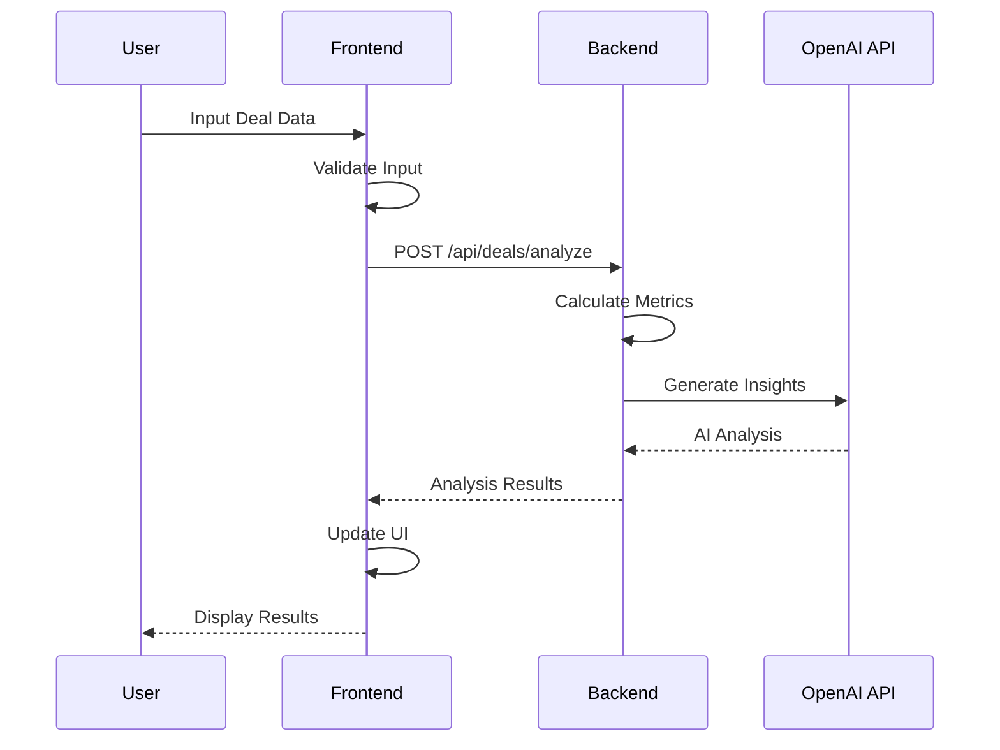
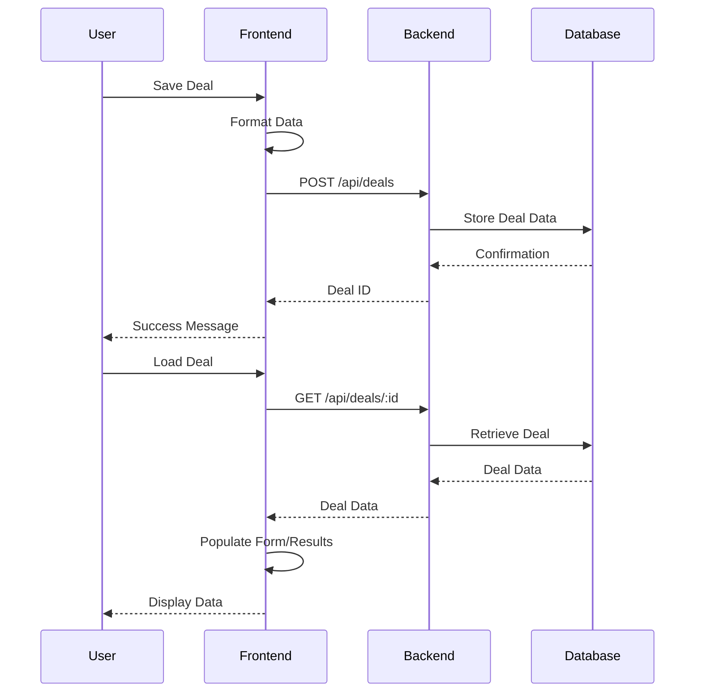

# Real Estate Deal Analyzer - Architecture Documentation

## System Overview
The Real Estate Deal Analyzer is a full-stack web application built using React (frontend) and Node.js/Express (backend). The application helps users analyze real estate investment opportunities by calculating key metrics and providing detailed financial projections for both Single Family (SFR) and Multi-Family (MF) properties.

## Technical Stack

### Frontend
- **Framework:** React 19 with TypeScript
- **UI Library:** Material-UI (MUI) v7
- **Data Visualization:** Recharts
- **State Management:** React Context API + React Hooks
- **Authentication:** React Context with JWT token management
- **Routing:** React Router v6 with protected routes
- **Type Checking:** TypeScript
- **Data Persistence:** MongoDB & Backend API
- **Build Tool:** Vite

### Backend
- **Runtime:** Node.js
- **Framework:** Express.js
- **Database:** MongoDB with Mongoose ODM
- **Authentication:** JWT (JSON Web Tokens) with bcrypt password hashing
- **Type Safety:** TypeScript
- **API Documentation:** OpenAPI/Swagger
- **Logging:** Winston
- **Error Handling:** Custom middleware
- **Security:** Role-based access control, auth middleware

## Authentication & User Management System

### Overview
Complete JWT-based authentication system with role-based access control, providing secure user management and admin capabilities.

### Authentication Architecture

#### Backend Components
1. **User Model** (`/backend/src/models/User.ts`)
   - MongoDB schema with bcrypt password hashing
   - Fields: email, password, firstName, lastName, role, isVerified
   - Methods: comparePassword(), getFullName()
   - Pre-save middleware for password hashing (12 salt rounds)

2. **Authentication Service** (`/backend/src/services/authService.ts`)
   - User registration and login logic
   - JWT token generation and validation
   - Password verification and user lookup

3. **Auth Middleware** (`/backend/src/middleware/auth.ts`)
   - JWT token verification
   - Request authentication decorator
   - Role-based authorization
   - Optional authentication for flexible endpoints

4. **Auth Controller** (`/backend/src/controllers/authController.ts`)
   - REST endpoints: register, login, refresh, profile management
   - Input validation and sanitization
   - Error handling and security logging

5. **Admin Controller** (`/backend/src/controllers/adminController.ts`)
   - User management endpoints (admin-only)
   - Role promotion/demotion
   - User verification status management
   - System statistics and monitoring

#### Frontend Components
1. **AuthContext** (`/frontend/src/contexts/AuthContext.tsx`)
   - Global authentication state management
   - Login, logout, register, profile update functions
   - Automatic token refresh and storage management

2. **Authentication Forms**
   - **LoginForm** (`/frontend/src/components/auth/LoginForm.tsx`)
   - **RegisterForm** (`/frontend/src/components/auth/RegisterForm.tsx`)
   - Material-UI components with validation
   - Error handling and loading states

3. **Protected Routes** (`/frontend/src/components/auth/ProtectedRoute.tsx`)
   - Route-level authentication guards
   - Automatic redirect to login for unauthenticated users
   - Role-based route protection

4. **User Management Pages**
   - **ProfilePage** (`/frontend/src/pages/ProfilePage.tsx`) - User profile management
   - **SettingsPage** (`/frontend/src/pages/SettingsPage.tsx`) - Account settings and preferences
   - **AdminUserManagement** (`/frontend/src/pages/AdminUserManagement.tsx`) - Admin user management dashboard

### Security Features
- **Password Security:** bcrypt hashing with 12 salt rounds
- **JWT Tokens:** Secure token-based authentication
- **Role-Based Access:** Admin/user role separation
- **Route Protection:** Frontend and backend route guards
- **Token Management:** Automatic refresh and secure storage
- **Input Validation:** Comprehensive validation on all inputs
- **Audit Logging:** Security event logging for admin actions

### User Roles
- **User:** Standard access to property analysis features
- **Admin:** Full system access + user management capabilities

### API Endpoints
- `POST /api/auth/register` - User registration
- `POST /api/auth/login` - User authentication
- `POST /api/auth/refresh` - Token refresh
- `GET /api/auth/profile` - Get user profile
- `PUT /api/auth/profile` - Update user profile
- `POST /api/auth/change-password` - Change password
- `GET /api/admin/users` - List all users (admin)
- `PUT /api/admin/users/:id/role` - Update user role (admin)
- `PUT /api/admin/users/:id/status` - Update user status (admin)

## Single-Family Rental (SFR) Analysis Implementation

### Core Components

1. **SFRPropertyForm** (`/frontend/src/components/SFRAnalysis/SFRPropertyForm.tsx`)
   - Collects all property data inputs including:
     - Property details (price, address, bedrooms, etc.)
     - Financial data (down payment, interest rate, loan term)
     - Monthly income and expenses
     - Long-term assumptions (appreciation, inflation, etc.)
   - Performs client-side validation
   - Submits data to analysis engine

2. **AnalysisResults** (`/frontend/src/components/SFRAnalysis/AnalysisResults.tsx`)
   - Tabbed interface for different analysis views:
     - Summary: Key metrics and investment indicators
     - Monthly Analysis: Detailed income and expense breakdown
     - Annual Analysis: Year 1 financial metrics
     - Long-Term Analysis: 10-year projections with charts
   - Visualization components:
     - Cash flow trend line chart
     - Expense breakdown pie chart
     - Equity growth area chart
     - Return components bar chart
   - Interactive tables for detailed metrics

3. **SFRAnalysis Page** (`/frontend/src/pages/SFRAnalysis.tsx`)
   - Coordinates between form and results components
   - Manages API calls for property analysis
   - Handles loading, saving, and error states
   - Provides sample data loading functionality

### Key Calculations

1. **Monthly Analysis**
   - **Monthly Mortgage Payment**: 
     ```typescript
     const monthlyMortgage = (principal, rate, term) => {
       const monthlyRate = rate / 12 / 100;
       const payments = term * 12;
       return (principal * monthlyRate * Math.pow(1 + monthlyRate, payments)) / 
              (Math.pow(1 + monthlyRate, payments) - 1);
     }
     ```
   - **Operating Expenses**: Sum of property tax, insurance, maintenance, property management, vacancy
   - **Cash Flow**: Effective Gross Income - Operating Expenses - Mortgage Payment

2. **Annual Analysis**
   - **Net Operating Income (NOI)**: Annual Effective Gross Income - Annual Operating Expenses
   - **Cap Rate**: (NOI / Purchase Price) * 100
   - **Cash on Cash Return**: (Annual Cash Flow / Total Investment) * 100
   - **Debt Service Coverage Ratio (DSCR)**: NOI / Annual Debt Service

3. **Long-Term Analysis**
   - **Year-over-Year Projections**:
     - Income growth based on rent increase percentage
     - Expense inflation adjustment
     - Property value appreciation
     - Mortgage balance reduction
     - Equity accumulation
   - **Return Calculations**:
     - IRR (Internal Rate of Return)
     - ROI (Return on Investment)
     - Total appreciation
     - Total cash flow
     - Total return

### Data Flow

1. User inputs property data into SFRPropertyForm
2. Form data is validated and sent to backend via API
3. Backend calculates all metrics and projections
4. Results are returned to frontend and displayed in AnalysisResults
5. User can save the analysis to the database
6. Saved deals can be loaded and viewed from SavedProperties page

### Validation & Error Handling

- Client-side form validation ensures required fields
- Backend validation confirms data integrity
- Error boundaries catch and display rendering errors
- Network error handling with user-friendly messages
- Edge case handling for zero values and missing data

## Technical Decisions

### 1. Data Storage Strategy
**Current Implementation:** Hybrid approach
- MongoDB for persistent storage (planned)
- Browser LocalStorage for temporary data
- Structured data format for both SFR and MF properties
- Unique ID generation for each deal
- Data model:
  ```typescript
  interface Deal {
    id: string;
    name: string;
    type: 'SFR' | 'MF';
    propertyAddress: {
      street: string;
      city: string;
      state: string;
      zip: string;
    };
    data: {
      // Property details
      purchasePrice: number;
      propertyType: string;
      yearBuilt: number;
      squareFootage: number;
      
      // Financial details
      downPayment: number;
      interestRate: number;
      loanTerm: number;
      closingCosts: number;
      repairCosts: number;
      
      // For MF properties
      unitTypes?: Array<{
        type: string;
        count: number;
        sqft: number;
        monthlyRent: number;
      }>;
      
      // Analysis results
      monthlyAnalysis: MonthlyAnalysis;
      annualAnalysis: AnnualAnalysis;
      longTermAnalysis: LongTermAnalysis;
    };
    savedAt: string;
    lastModified: string;
  }
  ```

### 2. Analysis Engine
**Current Implementation:**
- Comprehensive financial calculations:
  ```typescript
  interface MonthlyAnalysis {
    expenses: {
      rent?: number;
      propertyTax?: number;
      insurance?: number;
      maintenance?: number;
      propertyManagement?: number;
      vacancy?: number;
      mortgage?: {
        total: number;
        downPayment?: number;
      };
      closingCosts?: number;
      repairCosts?: number;
      total?: number;
    };
    cashFlow?: number;
    cashFlowAfterTax?: number;
  }

  interface AnnualAnalysis {
    dscr: number;
    cashOnCashReturn: number;
    capRate: number;
    totalInvestment: number;
    annualNOI: number;
    annualDebtService: number;
    effectiveGrossIncome: number;
  }

  interface LongTermAnalysis {
    yearlyProjections: Array<{
      year: number;
      cashFlow: number;
      propertyValue: number;
      equity: number;
      propertyTax: number;
      insurance: number;
      maintenance: number;
      propertyManagement: number;
      vacancy: number;
      operatingExpenses: number;
      noi: number;
      debtService: number;
      grossRent: number;
      mortgageBalance: number;
      appreciation: number;
      totalReturn: number;
    }>;
    projectionYears: number;
    returns: {
      irr: number;
      totalCashFlow: number;
      totalAppreciation: number;
      totalReturn: number;
    };
    exitAnalysis: {
      projectedSalePrice: number;
      sellingCosts: number;
      mortgagePayoff: number;
      netProceedsFromSale: number;
    };
  }
  ```

### 3. UI Components
**Key Components:**
1. **SFRPropertyForm**
   - Property details input
   - Financial assumptions
   - Form validation
   - Deal saving/loading

2. **AnalysisResults**
   - Key metrics display with tooltips
   - Monthly analysis table
   - Annual projections table
   - Exit analysis
   - Interactive charts:
     - Cash flow trends
     - Expense breakdown
     - Equity growth
     - Return components

3. **SavedProperties**
   - Professional table view of all properties
   - Metrics comparison columns
   - Sorting and filtering options
   - Property management actions

### 4. AI Integration Strategy
**Current Implementation:** Full OpenAI v5.8.2 Integration with Market Intelligence ✅
- Complete OpenAI API v5+ integration with modern client
- Using GPT-4o-mini for enhanced analysis quality and cost efficiency
- Structured JSON response format for reliable parsing
- Enhanced prompts for expert-level real estate analysis
- Comprehensive error handling with graceful fallbacks
- **PHASE 1 ENHANCEMENT:** Market Intelligence Integration ✅
  - Census data integration for market context analysis
  - Market analysis engine (`marketAnalysis.ts`) for standardized calculations
  - Score breakdown system with 4-category scoring framework
  - Property positioning analysis vs. local market medians
  - Affordability analysis based on median household income

```javascript
// Current implementation with OpenAI v5.8.2 and Market Intelligence
const getAIInsights = async (dealData, analysis) => {
  try {
    const openai = getOpenAIClient(); // Modern OpenAI client
    if (!openai) {
      return generateFallbackInsights();
    }

    // PHASE 1 ENHANCEMENT: Calculate comprehensive market analysis if census data is available
    let marketAnalysis = null;
    if (analysis.censusData) {
      const monthlyRent = dealData.propertyType === 'SFR' 
        ? dealData.monthlyRent 
        : dealData.unitTypes?.reduce((total, unit) => total + (unit.monthlyRent * unit.count), 0) || 0;
      
      marketAnalysis = performComprehensiveMarketAnalysis({
        propertyPrice: dealData.purchasePrice,
        monthlyRent: monthlyRent,
        marketMedianValue: analysis.censusData.housing?.medianHomeValue || dealData.purchasePrice,
        marketMedianRent: analysis.censusData.housing?.medianRent || monthlyRent,
        medianHouseholdIncome: analysis.censusData.income?.medianHouseholdIncome || 70000,
        vacancyRate: analysis.censusData.housing?.vacancyRate || 5,
        medianAge: analysis.censusData.demographics?.medianAge || 35,
        populationGrowth: analysis.censusData.demographics?.populationGrowth,
        propertyQuality: 5 // Default property quality score
      });
    }

    // Generate enhanced prompt based on property type with market intelligence
    const prompt = dealData.propertyType === 'SFR' 
      ? enhancedSfrAnalysisPrompt(dealData, analysis, marketAnalysis)
      : enhancedMfAnalysisPrompt(dealData, analysis, marketAnalysis);

    const response = await openai.chat.completions.create({
      model: 'gpt-4o-mini', // Latest efficient model
      messages: [
        {
          role: 'system',
          content: 'You are a sophisticated real estate investment analyst with 25+ years of experience...'
        },
        {
          role: 'user',
          content: prompt
        }
      ],
      max_tokens: 2000,
      temperature: 0.7,
      response_format: { type: 'json_object' } // Structured JSON response
    });

    return JSON.parse(response.choices[0].message.content);
  } catch (error) {
    logger.error('Error getting AI insights:', error);
    return generateFallbackInsights();
  }
};
```

**✅ Implemented Features:**
- **Expert-Level Analysis**: AI positioned as experienced real estate analyst
- **Strategic Insights**: Beyond basic metrics to investment strategy
- **Market Context**: Property positioning relative to market trends
- **Risk Assessment**: Quantified risk analysis with mitigation strategies
- **Value-Add Opportunities**: Specific improvement recommendations with ROI
- **Investor Matching**: Identifies optimal investor profiles for each property
- **Exit Strategy Analysis**: Data-driven recommendations for optimal hold periods
- **Financing Optimization**: Specific recommendations for financing structure
- **Portfolio Integration**: Analysis of how property fits investment portfolios
- **Opportunity Cost Analysis**: Comparison to alternative investments

**Enhanced Prompt Engineering:**
```javascript
// Enhanced prompt structure with detailed instructions
const enhancedSfrAnalysisPrompt = (dealData, analysis) => {
  return `You are a sophisticated real estate investment analyst with 25+ years of experience...
  
  ANALYSIS REQUIREMENTS:
  1. PROVIDE STRATEGIC CONTEXT with specific numbers and percentages
  2. IDENTIFY PATTERNS AND RELATIONSHIPS between metrics
  3. OFFER COMPARATIVE ANALYSIS against industry benchmarks
  4. PREDICT FUTURE PERFORMANCE based on market conditions
  5. MATCH TO INVESTOR PROFILES with specific reasoning
  6. SUGGEST RISK MITIGATION STRATEGIES with quantified impact
  7. IDENTIFY VALUE-ADD OPPORTUNITIES with ROI estimates
  8. OPTIMIZE EXIT STRATEGY based on equity and market cycles
  
  Respond with valid JSON in this exact format...
  `;
};
```

### 5. Market Analysis Engine (Phase 1 Enhancement) ✅

**Implementation:** Comprehensive market intelligence system integrated with AI analysis

**Location:** `backend/src/utils/marketAnalysis.ts`

The Market Analysis Engine provides standardized market intelligence calculations that integrate with both Census data and AI insights generation.

#### Core Functions

1. **Market Positioning Analysis**
   ```typescript
   export const calculateMarketPositioning = (
     propertyPrice: number, 
     marketMedianValue: number
   ): MarketPositioning => {
     const percentageDiff = ((propertyPrice - marketMedianValue) / marketMedianValue) * 100;
     
     let position: string;
     if (percentageDiff <= -20) position = 'Significantly Below Market';
     else if (percentageDiff <= -10) position = 'Below Market';
     else if (percentageDiff <= 10) position = 'At Market';
     else if (percentageDiff <= 20) position = 'Above Market';
     else position = 'Significantly Above Market';
     
     return {
       propertyValue: propertyPrice,
       marketMedian: marketMedianValue,
       percentageDiff,
       position,
       competitiveAdvantage: generateCompetitiveAdvantage(position, percentageDiff)
     };
   };
   ```

2. **Affordability Analysis**
   ```typescript
   export const calculateAffordabilityAnalysis = (
     monthlyRent: number,
     medianHouseholdIncome: number
   ): AffordabilityAnalysis => {
     const requiredIncome = monthlyRent * 12 * 3; // 3x income rule
     const affordabilityRatio = medianHouseholdIncome / requiredIncome;
     
     // Assessment and tenant pool size logic
     return {
       requiredIncome,
       medianIncome: medianHouseholdIncome,
       affordabilityRatio,
       assessment,
       tenantPoolSize
     };
   };
   ```

3. **Market Dynamics Assessment**
   ```typescript
   export const analyzeMarketDynamics = (
     vacancyRate: number,
     affordabilityRatio: number,
     populationGrowth?: number
   ): MarketDynamics => {
     // Calculates market condition, demand level, and investment timing
     return {
       vacancyRate,
       marketCondition,
       demandLevel,
       competitiveEnvironment,
       investmentTiming
     };
   };
   ```

4. **Comprehensive Market Analysis Integration**
   ```typescript
   export const performComprehensiveMarketAnalysis = (params) => {
     const marketPositioning = calculateMarketPositioning(params.propertyPrice, params.marketMedianValue);
     const affordabilityAnalysis = calculateAffordabilityAnalysis(params.monthlyRent, params.medianHouseholdIncome);
     const marketDynamics = analyzeMarketDynamics(params.vacancyRate, affordabilityAnalysis.affordabilityRatio, params.populationGrowth);
     const demographicInsights = generateDemographicInsights(params.medianAge, params.populationGrowth || 0);
     
     return {
       marketPositioning,
       affordabilityAnalysis,
       marketDynamics,
       demographicInsights,
       summary: generateMarketSummary(marketPositioning, affordabilityAnalysis, marketDynamics)
     };
   };
   ```

#### Integration Points

- **AI Service Integration**: Automatically called when Census data is available
- **Fallback Handling**: Graceful degradation when market data is unavailable  
- **Score Breakdown**: Market positioning feeds into AI scoring algorithm
- **Performance**: Optimized calculations with minimal computational overhead

## Architecture Diagram
```
┌─────────────────┐         ┌──────────────────┐         ┌─────────────────┐
│    Frontend     │         │     Backend      │         │    Database     │
│    (React)     │ ───────>│  (Node/Express)  │ ───────>│   (Optional)    │
└─────────────────┘         └──────────────────┘         └─────────────────┘
       │                           │
       │                           │
       ▼                           ▼
┌─────────────────┐         ┌──────────────────┐
│  Material UI    │         │  OpenAI API      │
│  Components     │         │  (AI Insights)   │
└─────────────────┘         └──────────────────┘
```

## Sequence Diagrams

### Deal Analysis Flow


### Data Persistence Flow


## Frontend Architecture

### Core Components

1. **SFRAnalysis** (`/frontend/src/pages/SFRAnalysis.tsx`)
   ```typescript
   interface AnalysisResult {
     monthlyAnalysis: MonthlyAnalysis;
     annualAnalysis: AnnualAnalysis;
     longTermAnalysis: LongTermAnalysis;
     keyMetrics: KeyMetrics;
   }
   ```
   - State Management:
     - `propertyData`: Stores property input data
     - `analysis`: Stores analysis results
     - `error`: Handles error states
   - Key Methods:
     - `handleAnalyzeProperty`: Processes form submission
     - `handleSaveDeal`: Saves deal to database
     - `loadDealData`: Loads existing deal

2. **SFRPropertyForm** (`/frontend/src/components/SFRAnalysis/SFRPropertyForm.tsx`)
   - Form Sections:
     - Property Information
     - Financial Details
     - Monthly Income/Expenses
     - Long-term Assumptions
   - Validation Rules:
     ```typescript
     const validateForm = (): boolean => {
       // Required fields check
       if (!formData.purchasePrice) {
         setError('Purchase price is required');
         return false;
       }
       // Additional validation rules...
       return true;
     };
     ```

3. **AnalysisResults** (`/frontend/src/components/SFRAnalysis/AnalysisResults.tsx`)
   - Display Components:
     - MetricCards: Key financial indicators
     - Charts: Data visualization
     - Tables: Detailed projections
   - Chart Types:
     - Line: Cash flow trends
     - Pie: Expense breakdown
     - Bar: Return components
     - Area: Equity growth

### UI Framework Details
- Material-UI (MUI) v7
  - Custom Theme:
    ```javascript
    const theme = {
      palette: {
        primary: { main: '#2563eb' },
        secondary: { main: '#4f46e5' }
      },
      typography: {
        fontFamily: 'Inter, Roboto, sans-serif'
      }
    }
    ```
  - Responsive Breakpoints:
    - xs: 0px
    - sm: 600px
    - md: 960px
    - lg: 1280px
    - xl: 1920px

## Backend Architecture

### API Layer
- Express.js Configuration:
  ```javascript
  app.use(cors());
  app.use(express.json());
  app.use(morgan('combined'));
  app.use('/api/deals', dealRoutes);
  app.use('/api/analyze', analyzeRoutes); // AI-enhanced analysis routes
  ```

### OpenAI Integration Layer
- Modern OpenAI v5.8.2 client configuration:
  ```javascript
  import OpenAI from 'openai';
  
  let openaiClient = null;
  
  export const getOpenAIClient = () => {
    if (!process.env.OPENAI_API_KEY) {
      logger.warn('OpenAI API key not found');
      return null;
    }
    
    if (!openaiClient) {
      openaiClient = new OpenAI({
        apiKey: process.env.OPENAI_API_KEY
      });
      logger.info('OpenAI client initialized successfully');
    }
    
    return openaiClient;
  };
  ```

### Core Modules

1. **Analysis Engine** (`/backend/src/utils/analysis.js`)
   - Financial Calculations:
     ```javascript
     // Monthly Cash Flow
     const calculateMonthlyCashFlow = (income, expenses) => {
       return income - expenses - mortgagePayment;
     };

     // Cap Rate
     const calculateCapRate = (noi, purchasePrice) => {
       return (noi * 12 / purchasePrice) * 100;
     };

     // Cash on Cash Return
     const calculateCashOnCash = (annualCashFlow, totalInvestment) => {
       return (annualCashFlow / totalInvestment) * 100;
     };

     // Internal Rate of Return (IRR)
     const calculateIRR = (cashFlows) => {
       // Newton-Raphson method implementation
     };
     ```

2. **Deal Controller** (`/backend/src/controllers/deals.js`)
   - Request Processing:
     ```javascript
     exports.analyzeDeal = async (req, res) => {
       try {
         const analysis = await performAnalysis(req.body);
         const aiInsights = await getAIInsights(analysis);
         res.json({ ...analysis, aiInsights });
       } catch (error) {
         handleError(error, res);
       }
     };
     ```

3. **AI Integration** (`/backend/src/services/aiService.ts`)
   - Modern OpenAI v5.8.2 Integration:
     ```typescript
     import { getOpenAIClient, generateAnalysis } from './openai';
     import { enhancedSfrAnalysisPrompt, enhancedMfAnalysisPrompt } from '../prompts/enhancedAIPrompts';
     
     export async function getAIInsights(dealData: SFRData | MultiFamilyData, analysis: any): Promise<AIInsights> {
       const openai = getOpenAIClient();
       if (!openai) {
         return generateFallbackInsights();
       }
       
       const prompt = dealData.propertyType === 'SFR' 
         ? enhancedSfrAnalysisPrompt(dealData, analysis)
         : enhancedMfAnalysisPrompt(dealData, analysis);
         
       return await generateAnalysis(prompt);
     }
     ```
   - Enhanced Prompt Engineering:
     ```typescript
     const enhancedSfrAnalysisPrompt = (dealData, analysis) => {
       return `You are a sophisticated real estate investment analyst...
         
         PROPERTY DETAILS:
         - Purchase Price: $${dealData.purchasePrice.toLocaleString()}
         - Monthly Rent: $${dealData.monthlyRent.toLocaleString()}
         - Cap Rate: ${analysis.keyMetrics.capRate.toFixed(2)}%
         ...
         
         ANALYSIS REQUIREMENTS:
         1. BE EXTREMELY SPECIFIC with numbers and percentages
         2. PROVIDE DEEP COMPARATIVE CONTEXT against benchmarks
         3. IDENTIFY SPECIFIC OPTIMIZATION OPPORTUNITIES
         4. ANALYZE RISK-ADJUSTED RETURNS with scenarios
         ...
         `;
     };
     ```

### Middleware Configuration
```javascript
// CORS
const corsOptions = {
  origin: process.env.FRONTEND_URL,
  methods: ['GET', 'POST', 'PUT', 'DELETE'],
  allowedHeaders: ['Content-Type', 'Authorization']
};

// Error Handling
const errorHandler = (err, req, res, next) => {
  logger.error(err.stack);
  res.status(500).json({ error: err.message });
};
```

### Logging Configuration
```javascript
const winston = require('winston');

const logger = winston.createLogger({
  level: 'info',
  format: winston.format.combine(
    winston.format.timestamp(),
    winston.format.json()
  ),
  transports: [
    new winston.transports.File({ filename: 'logs/error.log', level: 'error' }),
    new winston.transports.File({ filename: 'logs/all.log' })
  ]
});
```

## Data Adapter Architecture

### Storage vs. Calculation Rules

The application uses a clear set of rules to determine what data is stored in the database versus what is calculated on-demand. These rules are implemented in the `analysisAdapter.ts` module that handles data normalization between the backend and frontend.

#### Stored Data (Database)
The following data is preserved from the database:
1. **Core Property Data**:
   - Purchase price, rent, loan details, tax rates, etc.
   - Property characteristics (bedrooms, square footage, etc.)
   - Address and metadata

2. **Monthly Analysis Base Values**:
   - Monthly income/rent
   - Monthly expense breakdown (mortgage, tax, insurance, etc.)
   - Monthly cash flow

3. **AI Insights**:
   - Stored as-is when generated
   - Not recalculated unless explicitly requested

#### Calculated Data (On-Demand)
The following data is always recalculated when a deal is loaded:
1. **Year-by-Year Projections**:
   - Future property values with appreciation
   - Future rental income with growth
   - Future expenses with inflation
   - Mortgage balance and equity over time
   - Cash flow for each year

2. **Exit Analysis**:
   - Projected sale price
   - Selling costs
   - Mortgage payoff
   - Net proceeds from sale
   - Total return on investment

3. **Annual Totals** (if missing):
   - Annual income (derived from monthly × 12)
   - Annual expenses (derived from monthly × 12)
   - Annual cash flow

#### Adapter Rules Implementation
```typescript
/**
 * Adapter Rules:
 * 1. Core property data is preserved from the stored deal
 * 2. Monthly analysis is preserved with normalization to ensure consistent structure
 * 3. All projections are ALWAYS recalculated to ensure consistency
 * 4. Exit analysis is always recalculated based on the projections
 * 5. Annual analysis is derived from monthly values if missing
 * 6. AI Insights are preserved as-is from the stored deal
 */
export function adaptAnalysisForFrontend(analysis: any): any {
  // Implementation follows these rules
}
```

### Benefits of this Approach
1. **Consistency**: All derived values use the same calculation logic, regardless of when they were created
2. **Storage Efficiency**: Only core data is stored, reducing database size
3. **Flexibility**: Calculation logic can be updated without migrating existing data
4. **Resilience**: Missing or incomplete data is handled gracefully with recalculation

## Test Strategy

### Frontend Tests
- Unit Tests: Jest + React Testing Library
- Component Tests: Storybook
- E2E Tests: Cypress

### Backend Tests
- Unit Tests: Jest
- Integration Tests: Supertest
- API Tests: Postman Collections

## Performance Optimization

### Frontend
1. Code Splitting
2. Lazy Loading
3. Memoization
4. Virtual Scrolling for Large Tables

### Backend
1. Response Caching
2. Query Optimization
3. Rate Limiting
4. Compression

## Deployment

### Frontend (Netlify/Vercel)
```toml
[build]
  command = "npm run build"
  publish = "build"

[[redirects]]
  from = "/*"
  to = "/index.html"
  status = 200
```

### Backend (Node.js/PM2)
```javascript
// ecosystem.config.js
module.exports = {
  apps: [{
    name: "real-estate-analyzer",
    script: "src/index.js",
    instances: "max",
    exec_mode: "cluster",
    env: {
      NODE_ENV: "production",
      PORT: 3001
    }
  }]
};
```

## Future Enhancements

1. **Multi-Family Analysis**
   - Unit mix optimization
   - Building-specific expenses
   - Unit-by-unit analysis

2. **User Authentication**
   - JWT Implementation
   - Role-based Access Control

3. **Enhanced AI Features**
   - Market Analysis
   - Investment Recommendations
   - Risk Assessment

4. **PDF Reports**
   - Custom Templates
   - Dynamic Generation

5. **Market Data Integration**
   - Real Estate APIs
   - Market Trends

6. **Portfolio Analysis**
   - Aggregate metrics
   - Portfolio diversification
   - Performance comparison